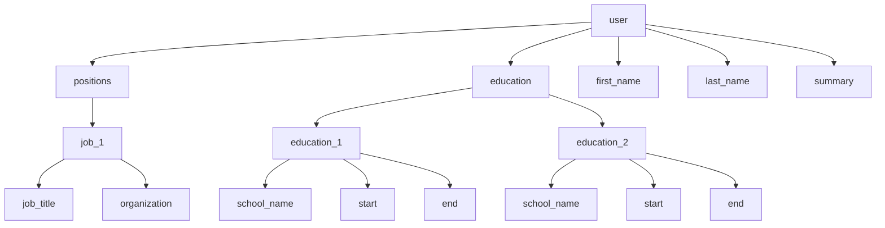

# Chapter 2. Data Models and Query Languages

Data models are the most important part of developing software. 

- They effect how the software is written
- They effect how we think about the problem

Applications are built by layering one data model on top of another:

1. Application developer uses models to represent data from real world, creates APIs to manipulate those data structures. Those structures are often specific to the application.
2. We need to store those data structures, we express them in JSON, XML, tables in a relational database, or a graph model.
3. JSON/XML/Tables/Graphs are data in term of bytes in memory, on disk, or on a network. The representation may allow the data to be queried, searched, manipulated, and processed in different ways.
4. On the lower level it is electrical signals, magnetic fields, or optical media.

Application data structure → general purpose data models json xml → databæse level → hardware level

Each layer hides the complexity of the layer below it providing a clean data model.

Mastering a data model is already hard. But since the data model has such a profound effect on what the software above it can and can't do it, it is important to choose one that is appropriate for the application.

In this chapter we will look at a range of general-purpose data models for data storage and querying.

In particular, we will look at:

- Relational model
- Document model
- Graph model

We will also look at query languages for each of these models.

## Relational Model Versus Document Model

Best know data model today is SQL, which is based on the relational model.

Sql: structured query language

Data is organized into relations (called tables in SQL). Each relation is an unordered collection of tuples (rows in SQL). Each tuple is an unordered collection of attributes (columns in SQL).

Root of relational databases lie in business data processing. It was performed on mainframe computers:

- Transaction processing: Recording and processing of business transactions
- Batch processing: Periodic processing of large amounts of data (e.g. payroll, billing)

Relational databases provided a cleaner interface.

In early times lots of alternatives emerged to relational databases but they didnt survive.

Today relational data bases are used for many different use cases:

- Online publishing
- Social networking
- E-commerce
- Games

### The Birth of NoSQL

NoSQL is the latest attempt to break the stranglehold of SQL. Initially they essociated with nosql hashtag.

But now they sell as not only sql.

There are several reasons for the adoption of NoSQL:

- Need for greater scalability than relational databases.Including very large datasets or very high write throughput.
- Free and open source software over commercial database products.
- Specialized query operations that are not well supported by the relational model.
- Frustration with the restrictiveness of the relational model.

Different applications have different requirements, probably NoSQL and SQL will coexist for a long time.

### The Object-Relational Mismatch

Most application development today is done in object-oriented programming languages.

If data is stored in relational tables, an awkward translation layer is required between the objects in the application code and the database model of tables, rows, and columns.

ORM frameworks like ActiveRecord and Hibernate reduce the amount of boilerplate code for the translation, but they don't eliminate the mismatch.

The disconnection between the models sometimes called an impedance mismatch (object-relational mismatch).

Imagine we are creating a resume page. We will use user, education, work experience, and skills.

- In traditional SQL model, the most common normalized representation is to put each type of information in a separate table.
- Later versions of SQL added support for structured data types (arrays, JSON, XML) to allow more flexibility in the schema.
- Third option is encoding everything into a single JSON or XML document and storing that in a single text column in a table.

```json
{
  "user": "user1",
  "first_name": "John",
  "last_name": "Doe",
  "summary": "Software Engineer",
  "education": [
    {"institution": "MIT", "degree": "PhD", "year": 2005},
    {"institution": "ETH", "degree": "MSc", "year": 2001}
  ],
  "work_experience": [
    {"company": "Google", "title": "Software Engineer", "year": 2010},
    {"company": "Facebook", "title": "Software Engineer", "year": 2008}
  ],
  "skills": [
    {"name": "C++", "level": "advanced"},
    {"name": "Java", "level": "advanced"}
  ]
}
```

Some developers think JSON model reduces the impedance mismatch between the application code and storage layer.

However there are also problems with JSON as a data encoding format. The lack of schema is often cited as an advantage.

JSON representation has better locality than the multi-table schema.

 In a relational example we need to perform multiple queries or perform a multi-way join.

The one-to-many relationships from the user profile to the user's positions, education, and skills imply a tree structure. JSON makes the tree structure explicit.

### Many-to-One and Many-to-Many Relationships

In previous resume example one-to-many relationships form a tree structure.



If user interface has free-text fields for region and industry, it could make sense to store them as plain text strings.

But there are advantages to having standard values for these fields, which user could select from drop-down list or autocomplete:

- Consistent style and spelling across profiles
- Avoiding ambiguity, if there are multiple places with the same name
- Ease of updating, if a place or industry name changes the name is stored in only one place
- Localization support, when the site is translated into other languages, the standard values can be translated
- Better search, if the standard values are used in search filters, it is easier to search for profiles that match a particular region or industry

When we store the ID, human meaningful info will be is stored in only one place. When we store the text directly, it will duplicate the human-meaningful info in every record that uses it.

Removing such duplication is the key idea behind normalization in databases.

Normalization is the process of organizing the columns and tables of a database to minimize data redundancy.

Denormalization is the process of trying to improve the read performance of a database at the expense of some write performance.

Normalizing data creates many-to-one relationships.

Which don't fit nicely into the document model. In relational databases we can refer to other to other rows in other tables by ID, because joins are easy. In document model, we don't have to make joins to create tree like structures, and support for joins are weak.

If the DB does not support joins, we have to make joins in app code by making multiple queries to DB.

We can start with a join-free document model, but the data has a tendency of becoming mode interconnected as features are added to applications.

Imagine we are adding a recommendation feature to the resume page. We want to show other user who approved the user skills. We need to create a one-to-many relationship.

### Are Document Databases Repeating History?

We use many-to-many relationships and joins for relational databases. 

But document databases and NoSQL reopened the debate on how best to represent such relationships in a database.

This debate is much older than NoSQL.

IMS was the first hierarchical database management system.

Like document databases, IMS worked well for one-to-many relationships, but it made many-to-many relationships difficult, and it didn't support joins.

The two most prominent solutions were relational model and network model.

- The Network Model: In the tree structure of the hierarchical model, a record could have exactly one parent. In the network model a record could have multiple parents.

Access Path: A path from one record to another, following the pointers. The network model allowed records to be linked in a graph, and it supported many-to-many relationships.

Access Path concept made queries more complex than in the hierarchical model. It was difficult to optimize queries.

- The Relational Model: Relational data lays out all the data in the open, this is contrast to the hierarchical and network models.

There are no labyrinthine nested structures, no complicated access paths.

In relational database, the query optimizer automatically decides which parts of the query to execute in which order, and which indexes to use.

We don't need to change the queries when the structure of the data changes, when we add a new index queries will automatically use it.

Thus relational model made it much easier to add new featured to applications.

- Comparison to Document Databases: Document databases reverted back to hierarchical model in one aspect: 
storing nested records within their parent record rather than in a separate table.

However, when it comes to representing many-to-one and many-to-many relationships, relational and document databases are not fundamentally different. 

In both cases the related item is referenced by a unique identifier:

- Foreign key in relational model
- Document reference in document model

### Relational Versus Document Databases Today

There are differences between relational and document databases today:

- Fault tolerance properties
- Handling of concurrency
- etc.

This part will inspect the data model differences

Document model provides:

- Better flexibility
- Better performance due to locality
- Closer data model to the application data structures

Relational model provides:

- Better support for joins
- Many-to-one and many-to-many relationships

#### Which data model leads to simpler application code?

If our app data has document like structure, tree of one-to-many relationships, where typically the entire tree is used at once.

Then it is a good idea to use a document model.

The relational technique of shredding, splitting a document into multiple tables can lead to cumbersome schemas and unnecessary complicated application code.

Document model has limitations, you cannot refer directly to a nested item in a document. This is not a problem if entities are not deeply nested.

Poor support of joins in a document model may or may not be a problem, it depends on the application.

If you applications uses many-to-many relationships, it is a good idea to use a relational model.

For interconnected data relational, graph models are better, if we use a document based db app code can become too complex.

#### Schema flexibility in the document model

Most document databases, and the JSON support in relational databases, are schemaless. 

They do not enforce any schema on the data in documents. XML support in relational databases usually comes with the optional schema validation.

No schema means that arbitrary keys and values can be added to a document, and when reading, clients have no guarantee as to what fields the documents may contain.

Document databases are sometimes called schemaless, but this is misleading.

The database still has an implicit schema, but it is not enforced by the database.

More accurate term is schema-on-read. It means that the schema is not enforced when writing, only when reading the data.

Other option is schema-on-write. It means that the schema is enforced when writing data. Relational databases use schema-on-write.

Schema-on-read is similar to dynamic (runtime) type checking in programming languages, and schema-on-write is similar to static (compile-time) type checking.

Schema changes have a bad reputation of being slow and requiring downtime. This reputation is not entirely deserved. Most relational databases can run ALTER TABLE statement in few milliseconds or seconds.

- If we have many different types of objects, and it is not practical to define a table for each type, then a document model is a good fit.

- The structure of the data is determined by external systems over which you have no control and which may change over time, then a document model is a good fit.

In these cases schema will hurt you more than it helps.

If the all records will be same we can use a schema.

#### Data locality for queries

A document is stored es a continuous string encoded as json, xml, binary.

It we need to access the whole document oftenly, this is a performance benefit from storage locality.

But this situation is applied if we need to access the whole document, otherwise of we change the small parts it will be wasteful.

Reading and writing large documents are expensive. So keeping the document size manageble is e logical thing.

Locality is not limited to document based db. Google spanner db provides nested tables for rows. Oracle also provides a similar function.

Multi-table index cluster tables is provided by oracle.

### Convergence of document end relational databases

Most relational dbs support xml documents, very similar to document databases. Also relational dbs support json for some time.

On the other hand document databases support relational database features like optimized joins.

This means databases ere becoming hybrid solutions which supports both perspectives by time.

## Query languages for data


Rerational databases introduced sql, declarative query language. Codasyl is a imperative language.

Programming languages are imperative mostly. An imperative language gives the instructions in a certain order.

Declerative query language like sal or relational algebra you specify the pattern of data you want.

Database query optimizer handles the underlying operations ,a declerative language is attractive because it is simpler and hides the details.

Also with this interface db can change the underlying infrastructure without impacting the app.

Imperative code is hard to parellelize. Code is open for optimization at the background. Database is free to do optimizations.

### Declarative queries on the web


```xml
<ul>
	<li class="selected">
  </li>
</ul>
```

Declarative languages are not just for databases. For exmeple we went to change the css of a website.

li.selected > p {
	background-color: blue;
}

With this code we can change the color, selects the li element with selected class under this conditions it gets the p element.

Applies the css to this element. We can do the same thing with xml. Both xml and css are declarative languages.

If we try the some thing with javascript it will be harder.it will require searching for the target element.

### Mapreduce querying

Mepreduce is a programing model for processing large amounts of data in bulk across many machines.

Mapreduce is not totally declerative or imperative it is between them it is partically supported by mongo db.

For example if want to generate a monthly report from e sql table we will use grouping.


If we do the same thing with mongo db ve will use a map function for every record, map function emits a key and a value.

For our case value will be the monthly record count. Emitted records will be grouped by key. Reduce function will add the numbers.

The map and reduce functions ere restricted at some level they need to be pure functions. They cant have side effects.

Same operation can be handled by a the sql query, using javascript within a db query is beneficial but mongo db is not the only way for it.

Relational db can also support calling javascript functions.

Also using a declerative language provides better support for optimization. Since mongo provided a declerative query language.

It is called aggregation pipeline.

This is a very similar thing to sql. For mongo it is just using ison syntax not the sql grammer.

Simply a no sql system is reinventing sql in disguise.

## Graph like data models

It our application date has a tree structure mostly consists one to many relations or no relations it is logical to use document model.

Relational model con handle some level of relational complexity.

But if we ere facing many to many relations, we can use grapto model our data.

A graph:

- vertices (nodes)
- edges

Social media, roads, the web pages they can be counted as graphs.

Some well established algorithms can operate on graphs, we can represent complex relations with graphs.

This part will discuss property graph model and triple store model.

## Property graphs


Each vertex contains:
- id
- outgoing edges 
- incoming edges
- key value pairs

Each edge contains:
- id 
- start vertex
- end vertex
- label to describe relationship
- key value pairs

We can imagine these two entities as 2 tables on e relational db.

In this concept:

- we can store any kind of relation
- we can find incoming and outgoing edges
- we can store multiple types of information on æ single graph

Graph is good for evolvebility, we can easily change the application data structure.

## Cypher query language

Cypher is a declerative query language.it is created for neo4J database.

We can create nodes end relations with it. We can say which person is living and born in which continent.

When we went to execute a query for some specific parameters it will bring the results. There are several ways to get this result.

It can scan all personal records and find the related connection containing nodes, or it can go backwards from the related continent modes.

Going backwards is more optimal. We don't have to think about it es e external api user, dp query optimizer will choose the most efficient path.


