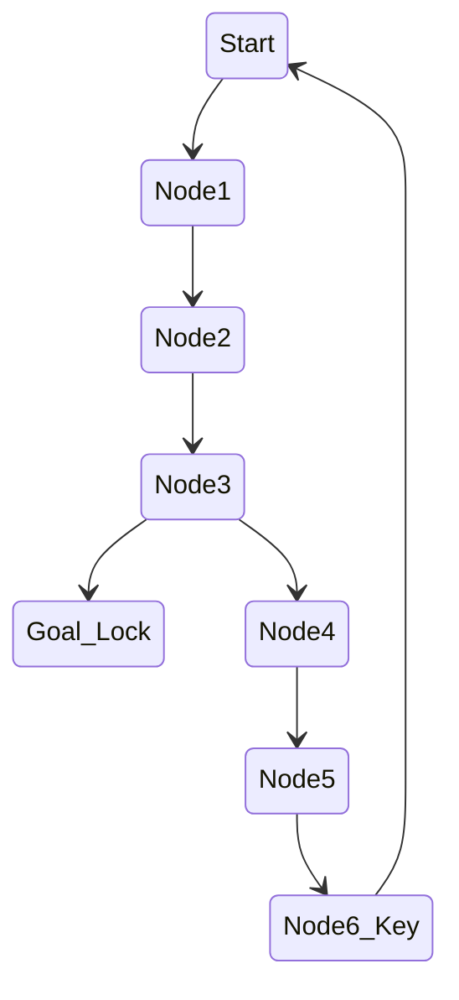

# Procedural Generation In Game Design

## Chapter 9 Cyclic Generation

There are several ways of generating dungeons for rogue like games. The most popular method is drilling out the dungeon from an arbitrary starting point. There are many dead ends in the result in this practice and user needs to backtrack. We can add connections between branches to make it better.

Cyclic generation uses a different approach.

### Cycles

In real world branching trees are rare. In most cities, buildings, and parks, you can go around in circles. Cycles are also very dominant in handcrafted levels. We can harvest some ideas from role-playing maps.

In regular dungeons start and goal points are located on the branches. Cycle method provides different approaches:

- We can use different challenges for alternative paths.
- We can use shorter but more dangerous paths.
- We can use directed connections to make the path more interesting.

### Using Graphs to Express Cycles

In general, when one is generating something as complex as a complete game level. It makes a lot of sense to break down the process into multiple steps.

We can use tile based representation for a graph on a 2D plane.

### Patterns

We can apply several graph transformation rules.

- Adding a secret shortcut to a long and dangerous level.
- Adding a lock to map and add a key at midpoint.

Our main goal is keeping the player engaged. We can use a lot of different patterns to achieve this goal.

### Implementation

Graph transformation and model-driven engineering are powerful methods, but to make them work in the way we wanted, we still had to add a couple of things.

The most important addition to the graph transformation rules are the attributes attached to nodes and edges in the graph.

### Aside: Lock and Key Attributes

Locks could be permanent, reversible, temporary, or collapsing.

- Permanent: A door remains unlocked forever.
- Temporary: Unlocked for a short period of time.
- Reversible: A door can be locked and unlocked multiple times.
- Collapsing: Collapses after use.

Locks might be valves or asymmetrical.

- Valve: Locks allow you to cross only in one direction.
- Asymmetrical: Opened from one direction.

Locks and keys can be safe or unsafe.

- Safe: A safe lock always has a solution.
- Unsafe: An unsafe lock might not have a solution.

Keys can be single purpose or multipurpose.

- Single purpose: A key can only open one lock.
- Multipurpose: A key can open multiple locks, it can be a multipurpose item.

Keys might be consumed or persistent.

- Consumed: A key is consumed after use. Consumed keys tend to be less safe.
- Persistent: A key is not consumed after use. Persistent keys tend to be more safe.

### Discussion

Cycles are very useful, most people prefer a walk or hike that not involve any backtracking.