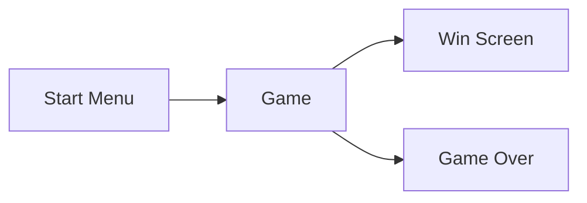

# Complete Godot 2D Develop Your Own 2D Games Using Godot 4

## Section 02 Speedy Saucer

### 8. Section Intro - Speedy Saucer

We will create a simple game called Speedy Saucer. We will try to keep saucer in the screen and avoid the obstacles.

### Project Setup

We will create an empty 2D scene.

We will get the assets from the kenney.nl website.

We will install the Space Shooter Redux asset from this [link](https://kenney.nl/assets/space-shooter-redux).

We will use:

- darkPurple.png
- purple.png
- ufoGreen.png

We will create a new TextureRect node we will add the darkPurple.png texture to it. We will set the stretch mode to tile to make the texture repeat itself. By this way resolution will not be a problem.

### 10. Nodes and Scenes

Nodes

- Fundamental building blocks of Godot
- Different nodes have different properties
- Nodes are grouped together to form a scene
- Nodes in a scene are organized in a tree structure

Scenes

- Grouped of nodes that organized as a tree
- Can be saved as a file
- Scenes are reusable
- A Godot game is made out of scenes



For the player node we will add a Rigidbody2D node. Also we will add a Sprite2D under the player node. We will add the ufoGreen.png texture to the sprite.

### 11. Rigidbody2D and Collision Shapes

Godot provides a physics engine. We can use it to simulate the physics in our game.

We can define the collision shapes for the nodes.

Godot provides 4 different types of collision shapes:

- Rigidbody2D
  - Uses Godot's physics engine
  - Needs a collision shape
  - CollisionSpace2D node

We will add a CollisionShape2D node under the player node. We will set the radius to 45 px, this will cover the whole saucer.

Important Note: Never set the size from Transform property. Always use the size property of the CollisionShape2D node.

### 12. Instancing Scenes

Instancing

- A scene is a tree of nodes
- We can split our game into scenes
- Instancing let's use scenes in other scenes

We can link the player scene to the main scene. We can use the link icon in the player scene. We can add the player scene to the main scene.

### 13. Editing Instances

If we want to edit the player scene we can click the edit button in the main scene. We can edit the player scene in the main scene. All copies of the player scene will be updated.

If we want to edit individual instances we can click the instance and click the edit button. We can edit the instance without affecting the other instances.

We can enable children property to edit the children of the instance.

### 14. Parent and Child Relationships

If we delete a parent node all the children will be deleted.

Position is relative to the parent node. If we move the parent node all the children will move with it.

### 15. Draw Order and Z Index

When we add a node it will be rendered with the default z index. We can change the z index from the inspector.

Higher z index will be rendered on top of the lower z index.

We can set a negative z index to render the node behind the other nodes.

### 16. Into To Scripting

Scripting:

- Scripts are files containing code.
- A node by itself has limited behavior.
- You will attach scripts to nodes to extend the default behavior.
- Example: Sprite2D node displays a texture by default. If you want the sprite to follow the mouse cursor, you would attach a script to it and add the movement code.

Scripting Languages of Godot

- GDScript
  - Python-like language
  - Designed for Godot
  - Easy to learn
  - Fast to write
  - Optimized for Godot
- C#
  - Popular language
  - Fast
  - Large community
  - Good for large projects
- C/C++
  - Fast
  - Low-level
  - Good for performance-critical code

You can use GDScript for most of the tasks. If you need performance-critical code you can use C# or C++.

We can add a script to player scene.

### 17. Functions and Printing Text

We can add a new script to the player scene. We can add a new function to the script. It can print a text to the console from the function.

```gd
extends RigidBody2D

func _ready():
    print("Hello, World!")
```

### 18. Number Operations and More Printing

We can do some basic number operations in GDScript.

```gd
extends RigidBody2D

func _ready():
    print(1 + 1)
    print(2 - 1)
    print(2 * 2)
    print(4 / 2)
    print(5 % 2)
    print(2 ** 3)
```

### 19. Introducing Variables

Variables store data.

Types of variables in GDScript:

- Integer
- Float
- String
- Boolean

var is used to define a variable.

```gd
var myInteger = 5
var myFloat = 5.5
var myString = "Hello, World!"
var myBoolean = true
```

### 20. Functions Parameters and Arguments

We can define functions with parameters.

```gd
extends RigidBody2D


# Called when the node enters the scene tree for the first time.
func _ready():
  test(10)

func test(param1):
  print(param1*2)
```

### 21. Vector2 and apply_impulse()

Vector2 is a built-in type in Godot. It is used to store 2D vectors.

We can use apply_impulse() function to apply a force to the RigidBody2D node.

```gd
extends RigidBody2D

# Called when the node enters the scene tree for the first time.
func _ready():
	apply_impulse(Vector2(25, -10))
```

Apply impulse is useful when we want to apply a force to the object once.

