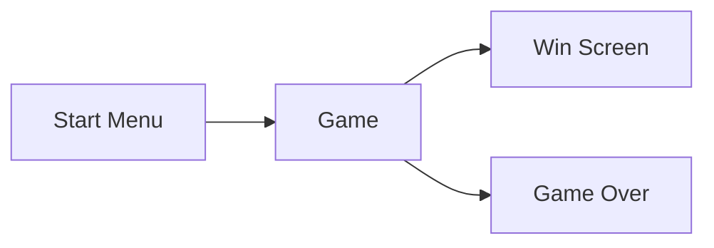

# Complete Godot 2D Develop Your Own 2D Games Using Godot 4

## Section 02 Speedy Saucer

### 8. Section Intro - Speedy Saucer

We will create a simple game called Speedy Saucer. We will try to keep saucer in the screen and avoid the obstacles.

### Project Setup

We will create an empty 2D scene.

We will get the assets from the kenney.nl website.

We will install the Space Shooter Redux asset from this [link](https://kenney.nl/assets/space-shooter-redux).

We will use:

- darkPurple.png
- purple.png
- ufoGreen.png

We will create a new TextureRect node we will add the darkPurple.png texture to it. We will set the stretch mode to tile to make the texture repeat itself. By this way resolution will not be a problem.

### 10. Nodes and Scenes

Nodes

- Fundamental building blocks of Godot
- Different nodes have different properties
- Nodes are grouped together to form a scene
- Nodes in a scene are organized in a tree structure

Scenes

- Grouped of nodes that organized as a tree
- Can be saved as a file
- Scenes are reusable
- A Godot game is made out of scenes

For the player node we will add a Rigidbody2D node. Also we will add a Sprite2D under the player node. We will add the ufoGreen.png texture to the sprite.

### 11. Rigidbody2D and Collision Shapes

Godot provides a physics engine. We can use it to simulate the physics in our game.

We can define the collision shapes for the nodes.

Godot provides 4 different types of collision shapes:

- Rigidbody2D
  - Uses Godot's physics engine
  - Needs a collision shape
  - CollisionSpace2D node

We will add a CollisionShape2D node under the player node. We will set the radius to 45 px, this will cover the whole saucer.

Important Note: Never set the size from Transform property. Always use the size property of the CollisionShape2D node.

