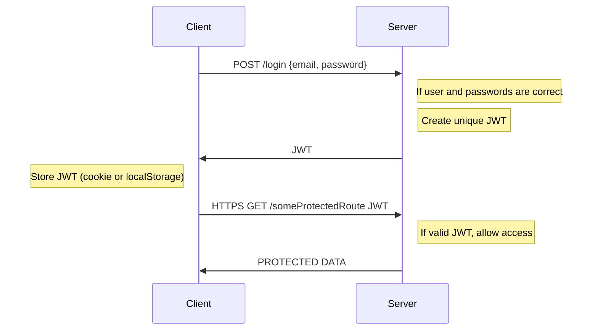

# Node.js, Express, MongoDB & More: The Complete Bootcamp 2023

## 10. Section 10: Authentication, Authorization and Security

### 10.124. Section Intro

Authentication and authorization are two of the most important topics in web development.

We will use JSON Web Tokens (JWT) to authenticate users and protect routes.

### 10.125. Modelling Users

We will use the following schema for users:

```js
const mongoose = require("mongoose");
const validator = require("validator");

const userSchema = new mongoose.Schema({
  name: {
    type: String,
    required: [true, "A user must have a name"],
    unique: true,
    trim: true,
    maxlength: [40, "A user name must have less or equal then 40 characters"],
    minlength: [10, "A user name must have more or equal then 10 characters"],
    validator: [validator.isAlpha, "User name must only contain characters"],
  },
  email: {
    type: String,
    required: [true, "A user must have an email"],
    unique: true,
    lowercase: true,
    validator: [validator.isEmail, "Please provide a valid email"],
  },
  photo: {
    type: String,
    default: "default.jpg",
  },
  password: {
    type: String,
    required: [true, "A user must have a password"],
    minlength: [
      10,
      "A user password must have more or equal then 10 characters",
    ],
  },
  passwordConfirm: {
    type: String,
    required: [true, "A user must have a password confirmation"],
    trim: true,
    maxlength: [
      40,
      "A user password confirmation must have less or equal then 40 characters",
    ],
    minlength: [
      10,
      "A user password confirmation must have more or equal then 10 characters",
    ],
  },
});

const User = mongoose.model("User", userSchema);
module.exports = User;
```

We will use a minimum of 10 characters rule for passwords.

### 10.126. Creating New Users

We will introduce a sign up endpoint to users controller÷

```js
const User = require("../models/userModel");
const catchAsync = require("../utils/catchAsync");

exports.signup = catchAsync(async (req, res, next) => {
  const newUser = await User.create(req.body);

  res.status(201).json({
    status: "success",
    data: {
      user: newUser,
    },
  });
});
```

Again we are using `catchAsync` handler for DB schema operation. On the router side we will create a new endpoint:

```js
const express = require("express");
const userController = require("../controllers/userController");
const authController = require("../controllers/authController");

const router = express.Router();

router.post("/signup", authController.signup);
```

### 10.127. Managing Passwords

We will introduce some rules to user schema:

```js
const mongoose = require("mongoose");
const validator = require("validator");
const bcrypt = require("bcryptjs");

const userSchema = new mongoose.Schema({
  //...
  passwordConfirm: {
    type: String,
    required: [true, "A user must have a password confirmation"],
    trim: true,
    maxlength: [
      40,
      "A user password confirmation must have less or equal then 40 characters",
    ],
    minlength: [
      10,
      "A user password confirmation must have more or equal then 10 characters",
    ],
    validate: {
      // this only works with SAVE, when we create a new object
      validator: function (element) {
        return element === this.password;
      },
      message: "Passwords are not the same",
    },
  },
});

userSchema.pre("save", async function (next) {
  if (!this.isModified("password")) return next();
  this.password = await bcrypt.hash(this.password, 12);
  this.passwordConfirm = undefined;
  next();
});

const User = mongoose.model("User", userSchema);
module.exports = User;
```

We will compare the password and confirm password. Also we will use bcrypt to create a hash of the password, we are using `saltround` 12 value for CPU intensive hashing.

### 10.128. How Authentication with JWT Works

JWT (JSON Web Token) is a compact, URL-safe means of transmitting information between parties as a JSON object. It is often used for authentication and authorization purposes, allowing the transmitting party to assert a claim about the token’s subject.

A JWT consists of three parts:

1. Header: Contains information about how the JWT is encoded.

2. Payload: Contains the claims. Claims are statements about an entity (typically, the user) and additional metadata.

3. Signature: A signature created by combining the encoded header and payload and a secret key, to verify that the sender of the JWT is who it claims to be.

The recipient of a JWT first verifies the signature to ensure that it was created by a trusted source, then it can use the claims to determine what access to grant the requesting party.



### 10.129. Signing Up Users

We will add the following JWT implementation:

```js
const jwt = require("jsonwebtoken");
const User = require("../models/userModel");
const catchAsync = require("../utils/catchAsync");

exports.signup = catchAsync(async (req, res, next) => {
  //safe implementation
  const newUser = await User.create({
    name: req.body.name,
    email: req.body.email,
    password: req.body.password,
    passwordConfirm: req.body.passwordConfirm,
  });

  //we can pass some options

  const token = jwt.sign({ id: newUser._id }, process.env.JWT_SECRET, {
    expiresIn: process.env.JWT_EXPIRES_IN,
  });

  res.status(201).json({
    status: "success",
    token,
    data: {
      user: newUser,
    },
  });
});
```

We can check the https://jwt.io/ token and inspect the response.

### 10.130. Logging in Users

For the logging flow we will compare the existing user password with the provided password. If the password is correct we will create a JWT token and send it back to the client. Password is hashed previously when we sign up a user, again we need to compare the hashed versions of the original user password and provided password.

```js
exports.login = catchAsync(async (req, res, next) => {
  const { email, password } = req.body;

  if (!email || !password) {
    return next(new AppError("Please provide email and password", 400));
  }

  const user = await User.findOne({ email }).select("+password");
  console.log(">>>>user", user);
  let correct = false;
  if (user) {
    correct = await user.correctPassword(password, user.password);
  }
  if (!user || !correct) {
    return next(new AppError("Incorrect email or password", 401));
  }

  const token = signToken(user._id);

  res.status(200).json({
    status: "success",
    token,
  });
});
```

This is the login method, `user.correctPassword` is a method we will add to the user model, it will become a instance method, with this method we will compare the passwords.

`signToken` is a helper function we will JWT.

```js
function signToken(id) {
  return jwt.sign({ id }, process.env.JWT_SECRET, {
    expiresIn: process.env.JWT_EXPIRES_IN,
  });
}
```

On the user model we will hide the password field from the standard output, and we will add a method to compare the passwords, we will fetch the password as a specific property with `select('+password')` and send both passwords to instance compare method:

```js
userSchema.methods.correctPassword = async function (
  candidatePassword,
  userPassword
) {
  return await bcrypt.compare(candidatePassword, userPassword);
};
```

Hidden properties:

```js
  password: {
    ...
    select: false,
    ...
  },
  passwordConfirm: {
    ...
    select: false,
    ...
  },
```

Additionally we need to add login path:

```js
router.post("/login", authController.login);
```

### 10.131. Protecting Tour Routes - Part 1

We will create a basic middleware to protect the routes, we will check if the user is logged in, and if the user is logged in we will check if the user has a valid JWT token.

```js
exports.protect = catchAsync(async (req, res, next) => {
  //1) Getting token and check if it exists
  let token;
  if (
    req.headers.authorization &&
    req.headers.authorization.startsWith("Bearer")
  ) {
    token = req.headers.authorization.split(" ")[1];
  }

  console.log(">>>>token", token);

  if (!token) {
    return next(
      new AppError("You are not logged in! Please log in to get access.", 401)
    );
  }

  //2) Verification token

  //3) Check if user still exists

  //4) Check if user changed password after the JWT was issued
  next();
});
```

This is the initial version of the `protect` middleware, we will check if the token exists, and if it exists we will verify the token.

```js
router
  .route("/")
  .get(authController.protect, tourController.getAllTours)
  .post(tourController.createTour);
```

We will add the `protect` middleware to the `getAllTours` route for test purpose and test the endpoint with Postman by including the JWT token in the header as bearer token.

### 10.132. Protecting Tour Routes - Part 2

We will improve the `protect` middleware, we will verify the token and check if the user still exists.

```js
exports.protect = catchAsync(async (req, res, next) => {
  //1) Getting token and check if it exists
  let token;
  if (
    req.headers.authorization &&
    req.headers.authorization.startsWith("Bearer")
  ) {
    token = req.headers.authorization.split(" ")[1];
  }

  if (!token) {
    return next(
      new AppError("You are not logged in! Please log in to get access.", 401)
    );
  }

  //2) Verification token
  const decoded = await promisify(jwt.verify)(token, process.env.JWT_SECRET);

  //3) Check if user still exists
  const currentUser = await User.findById(decoded.id);
  if (!currentUser) {
    return next(
      new AppError(
        "The user belonging to this token does no longer exist.",
        401
      )
    );
  }

  //4) Check if user changed password after the JWT was issued
  if (currentUser.changedPasswordAfter(decoded.iat)) {
    return next(
      new AppError("User recently changed password! Please log in again.", 401)
    );
  }

  //Grant access to protected route
  req.user = currentUser;
  next();
});
```

We are checking the decoded user data with waiting the response of decoded token. It will decode the user id from the token and check if the user exists. If the user exists we will check if the user changed the password after the token was issued. If the user changed the password we will throw an error, otherwise we will grant access to the protected route.

Also we will add the user into to req.

We will add 2 new cases to error handler:

```js
const errorHandler = (err, req, res, next) => {
  console.error(err.stack);

  err.statusCode = err.statusCode || 500;
  err.status = err.status || "error";

  if (process.env.NODE_ENV === "development") {
    sendErrorDev(err, res);
  } else if (process.env.NODE_ENV === "production") {
    let error = { ...err };
    if (err.name === "CastError") error = handleCastErrorDB(error);
    if (error.code === 11000) error = handleDuplicateFieldsDB(error);
    if (err.name === "ValidationError") error = handleValidationErrorDB(error);
    if (err.name === "JsonWebTokenError") error = handleJWTError();
    if (err.name === "TokenExpiredError") error = handleJWTExpiredError();

    sendErrorProd(error, res);
  }
};
```

`handleJWTError` and `handleJWTExpiredError` will be new cases for token decode operations.

Finally we need to add a `passwordChangedAt` property to the user model:

```js
passwordChangedAt: Date,
```

### 10.133. Advanced Postman Setup

We will use environment variables in Postman to store the JWT token and URL, we will create a new environment and add the JWT token as a variable.

We can also use the `pm` object to store the token in the environment variable:

```js
pm.environment.set("jwt", pm.response.json().token);
```


### 10.134. Authorization: User Roles and Permissions

Most of the cases we will allow a specific user role/roles to take some actions. This requires restricting access to certain routes for certain users. We will create a middleware to check if the user has the correct role to access the route.

```js
exports.restrictTo =
  (...roles) =>
  (req, res, next) => {
    if (!roles.includes(req.user.role)) {
      return next(
        new AppError("You do not have permission to perform this action", 403)
      );
    }
    next();
  };
```

This is a higher order function, we will pass the roles as arguments and return a middleware function. We will check if the user role is included in the roles array, if not we will throw an error.

```js
router
  .route("/:id")
  .get(tourController.getTour)
  .patch(tourController.updateTour)
  .delete(
    authController.protect,
    authController.restrictTo("admin", "lead-guide"),
    tourController.deleteTour
  );
```

Addtionally we will add the role enumeration to `userModel`:

```js
const userSchema = new mongoose.Schema({
  ...
  role: {
    type: String,
    enum: ['user', 'guide', 'lead-guider', 'admin'],
    default: 'user',
  },
  ...
});
```

### 10.135. Password Reset Functionality: Reset Token

We will add a reset function to user model, it will create a reset token with a 10 minutes expiration time:

```js
userSchema.methods.createPasswordResetToken = function () {
  const resetToken = crypto.randomBytes(32).toString('hex');
  this.passwordResetToken = crypto
    .createHash('sha256')
    .update(resetToken)
    .digest('hex');
  this.passwordResetExpires = Date.now() + 10 * 60 * 1000;
  return resetToken;
};
```

We will create 2 new routes for password reset:

```js
exports.forgotPassword = catchAsync(async (req, res, next) => {
  // 1) Get the user with posted email
  const user = await User.findOne({ email: req.user.email });
  if (!user) {
    return next(new AppError('There is no user with email address', 404));
  }

  // 2) Generate random reset token
  const resetToken = user.createPasswordResetToken();

  await User.save({ validateBeforeSAve: false });

  // 3) send it to user's email address
});
exports.resetPassword = (req, res, next) => {};
```

We will use `crypto` module to generate a random token and `sha256` to hash the token. We will also add a 10 minutes expiration time to the token.

### 10.136. Password Reset Functionality: Setting New Password

First we need to send the password reset token with a email, we will use nodemailer to send the email:

```js
const nodemailer = require('nodemailer');

const sendEmail = async (options) => {
  // 1) Create a transporter
  const transporter = nodemailer.createTransport({
    host: process.env.EMAIL_HOST,
    port: process.env.EMAIL_PORT,
    auth: {
      user: process.env.EMAIL_USERNAME,
      pass: process.env.EMAIL_PASSWORD,
    },
  });

  // 2) Define the email options
  const mailOptions = {
    from: 'Huseyin Can Ercan <uscanercan@gmail.com>',
    to: options.email,
    subject: options.subject,
    text: options.message,
    // html
  };

  // 3) Actually send the email
  await transporter.sendMail(mailOptions);
};

module.exports = sendEmail;
```

At the moment we are using mailtrap to catch the emails, we will use sendgrid to send the emails in production. Out config file will look like this:

```config
NODE_ENV = development
PORT = 8000
DATABASE_PASSWORD=******
DATABASE_USERNAME=******
DATABASE=*****
JWT_EXPIRES_IN=1d
EMAIL_USERNAME=******
EMAIL_PASSWORD=******
EMAIL_HOST=sandbox.smtp.mailtrap.io
EMAIL_PORT=2525
```

At this point we need to improve the forgot password handler, we need to use email service to send the reset token to the user:

```js
exports.forgotPassword = catchAsync(async (req, res, next) => {
  // 1) Get the user with posted email
  const user = await User.findOne({ email: req.body.email });
  if (!user) {
    return next(new AppError('There is no user with email address', 404));
  }

  // 2) Generate random reset token
  const resetToken = user.createPasswordResetToken();
  await user.save({ validateBeforeSAve: false });

  // 3) send it to user's email address
  const resetURL = `${req.protocol}://${req.get(
    'host'
  )}/api/v1/users/reserPassword/${resetToken}`;

  const message = `Forgot your password? Submit a PATCH request with your new password and 
  password confirmation to: ${resetURL}\nOtherwise ignore this email.`;
  try {
    await sendEmail({
      email: user.email,
      subject: 'Your password reset token (valid for 10 min)',
      message,
    });
  } catch (error) {
    console.log('>>>>error', error);
    user.createPasswordResetToken = undefined;
    user.passwordResetExpires = undefined;
    user.save({ validateBeforeSave: false });
    return next(
      new AppError(
        'There was an error sending the email. Try again later!',
        500
      )
    );
  }

  res.status(200).json({
    status: 'success',
    message: 'Token sent to email',
  });
});
```

In case of an error we will reset the token and expiration time.

### 10.137. Password Reset Functionality: Setting New Password

As the basic steps we need to do these:

1) Get user based on the token
2) If token has not expired, and there is user, set the new password
3) Update changedPasswordAt property for the user
4) Log the user in, send JWT

Out reset password handler will look like this:

```js
exports.resetPassword = catchAsync(async (req, res, next) => {
  // 1) Get user based on the token

  const hashedToken = crypto
    .createHash('sha256')
    .update(req.params.token)
    .digest('hex');

  const user = await User.findOne({
    passwordResetToken: hashedToken,
    passwordResetExpires: { $gt: Date.now() },
  });

  // 2) If token has not expired, and there is user, set the new password

  if (!user) {
    return next(new AppError('Token is invalid or has expired', 400));
  }

  user.password = req.body.password;
  user.passwordConfirm = req.body.passwordConfirm;
  user.passwordResetToken = undefined;
  user.passwordResetExpires = undefined;

  await user.save();

  // 3) Update changedPasswordAt property for the user

  // 4) Log the user in, send JWT
  const token = signToken(user._id);
  res.status(200).json({
    status: 'success',
    token,
  });
});
```

At this point we are using save method, it will provide some cover for us.

We will use some additional checks on the model:
  
```js
userSchema.pre('save', async function (next) {
  // Only run this function if password was actually modified
  if (!this.isModified('password')) return next();

  // Hash the password with cost of 12
  this.password = await bcrypt.hash(this.password, 12);

  // Delete passwordConfirm field
  this.passwordConfirm = undefined;
  next();
});

userSchema.pre('save', function (next) {
  if (!this.isModified('password') || this.isNew) return next();

  this.passwordChangedAt = Date.now() - 1000;
  next();
});
```

We can provide one additional property to user, `passwordChangedAt` to keep track of the password changes. Both of the pre save hooks will run before the save method when we update the password.

### 10.138. Updating the Current User: Password

We may want to update the user password with the current password, we will add a new handler for this:

```js
exports.updatePassword = catchAsync(async (req, res, next) => {
  // 1) Get user from collection
  const user = await User.findById(req.user.id).select('+password');

  // 2) Check if POSTed current password is correct
  if (!(await user.correctPassword(req.body.passwordCurrent, user.password))) {
    return next(new AppError('Your current password is wrong', 401));
  }

  // 3) If so, update password
  user.password = req.body.password;
  user.passwordConfirm = req.body.passwordConfirm;
  await user.save();
  // 4) Log user in, send JWT
  const token = signToken(user._id);
  res.status(200).json({
    status: 'success',
    token,
  });
});
```

We need to provide the new route:

```js
router.patch(
  '/updateMyPassword',
  authController.protect,
  authController.updatePassword
);
```

### 10.139. Updating the Current User: Data

We will introduce a new handler to update the non-critical user information:
  
```js
exports.updateMe = catchAsync(async (req, res, next) => {
  // 1) Create error if user POSTs password data
  if (req.body.password || req.body.passwordConfirm) {
    return next(
      new AppError(
        'This route is not for password updates. Please use /updateMyPassword.',
        400
      )
    );
  }

  // 2) Filter unwanted properties and update user document
  const filteredBody = filterObj(req.body, 'name', 'email');
  console.log(filteredBody);
  const updatedUser = await User.findByIdAndUpdate(req.user.id, filteredBody, {
    new: true,
    runValidators: true,
  });

  res.status(200).json({
    status: 'success',
    data: {
      user: updatedUser,
    },
  });
});
```

In this handler we will sanitize the request body, and update the user information. Also we will apply the protect middleware to this route:

```js
router.patch('/updateMe', authController.protect, userController.updateMe);
```

### 10.140. Deleting the Current User
