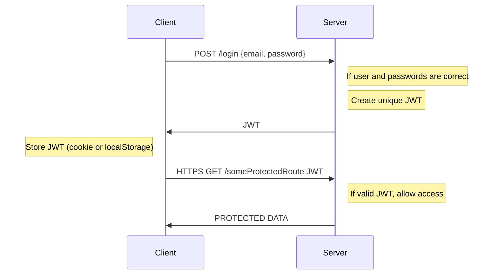

# Node.js, Express, MongoDB & More: The Complete Bootcamp 2023

## 10. Section 10: Authentication, Authorization and Security

### 10.124. Section Intro

Authentication and authorization are two of the most important topics in web development.

We will use JSON Web Tokens (JWT) to authenticate users and protect routes.

### 10.125. Modelling Users

We will use the following schema for users:

```js
const mongoose = require("mongoose");
const validator = require("validator");

const userSchema = new mongoose.Schema({
  name: {
    type: String,
    required: [true, "A user must have a name"],
    unique: true,
    trim: true,
    maxlength: [40, "A user name must have less or equal then 40 characters"],
    minlength: [10, "A user name must have more or equal then 10 characters"],
    validator: [validator.isAlpha, "User name must only contain characters"],
  },
  email: {
    type: String,
    required: [true, "A user must have an email"],
    unique: true,
    lowercase: true,
    validator: [validator.isEmail, "Please provide a valid email"],
  },
  photo: {
    type: String,
    default: "default.jpg",
  },
  password: {
    type: String,
    required: [true, "A user must have a password"],
    minlength: [
      10,
      "A user password must have more or equal then 10 characters",
    ],
  },
  passwordConfirm: {
    type: String,
    required: [true, "A user must have a password confirmation"],
    trim: true,
    maxlength: [
      40,
      "A user password confirmation must have less or equal then 40 characters",
    ],
    minlength: [
      10,
      "A user password confirmation must have more or equal then 10 characters",
    ],
  },
});

const User = mongoose.model("User", userSchema);
module.exports = User;
```

We will use a minimum of 10 characters rule for passwords.

### 10.126. Creating New Users

We will introduce a sign up endpoint to users controller÷

```js
const User = require("../models/userModel");
const catchAsync = require("../utils/catchAsync");

exports.signup = catchAsync(async (req, res, next) => {
  const newUser = await User.create(req.body);

  res.status(201).json({
    status: "success",
    data: {
      user: newUser,
    },
  });
});
```

Again we are using `catchAsync` handler for DB schema operation. On the router side we will create a new endpoint:

```js
const express = require("express");
const userController = require("../controllers/userController");
const authController = require("../controllers/authController");

const router = express.Router();

router.post("/signup", authController.signup);
```

### 10.127. Managing Passwords

We will introduce some rules to user schema:

```js
const mongoose = require("mongoose");
const validator = require("validator");
const bcrypt = require("bcryptjs");

const userSchema = new mongoose.Schema({
  //...
  passwordConfirm: {
    type: String,
    required: [true, "A user must have a password confirmation"],
    trim: true,
    maxlength: [
      40,
      "A user password confirmation must have less or equal then 40 characters",
    ],
    minlength: [
      10,
      "A user password confirmation must have more or equal then 10 characters",
    ],
    validate: {
      // this only works with SAVE, when we create a new object
      validator: function (element) {
        return element === this.password;
      },
      message: "Passwords are not the same",
    },
  },
});

userSchema.pre("save", async function (next) {
  if (!this.isModified("password")) return next();
  this.password = await bcrypt.hash(this.password, 12);
  this.passwordConfirm = undefined;
  next();
});

const User = mongoose.model("User", userSchema);
module.exports = User;
```

We will compare the password and confirm password. Also we will use bcrypt to create a hash of the password, we are using `saltround` 12 value for CPU intensive hashing.

### 10.128. How Authentication with JWT Works

JWT (JSON Web Token) is a compact, URL-safe means of transmitting information between parties as a JSON object. It is often used for authentication and authorization purposes, allowing the transmitting party to assert a claim about the token’s subject.

A JWT consists of three parts:

1. Header: Contains information about how the JWT is encoded.

2. Payload: Contains the claims. Claims are statements about an entity (typically, the user) and additional metadata.

3. Signature: A signature created by combining the encoded header and payload and a secret key, to verify that the sender of the JWT is who it claims to be.

The recipient of a JWT first verifies the signature to ensure that it was created by a trusted source, then it can use the claims to determine what access to grant the requesting party.



### 10.129. Signing Up Users

We will add the following JWT implementation:

```js
const jwt = require("jsonwebtoken");
const User = require("../models/userModel");
const catchAsync = require("../utils/catchAsync");

exports.signup = catchAsync(async (req, res, next) => {
  //safe implementation
  const newUser = await User.create({
    name: req.body.name,
    email: req.body.email,
    password: req.body.password,
    passwordConfirm: req.body.passwordConfirm,
  });

  //we can pass some options

  const token = jwt.sign({ id: newUser._id }, process.env.JWT_SECRET, {
    expiresIn: process.env.JWT_EXPIRES_IN,
  });

  res.status(201).json({
    status: "success",
    token,
    data: {
      user: newUser,
    },
  });
});
```

We can check the https://jwt.io/ token and inspect the response.

### 10.130. Logging in Users

For the logging flow we will compare the existing user password with the provided password. If the password is correct we will create a JWT token and send it back to the client. Password is hashed previously when we sign up a user, again we need to compare the hashed versions of the original user password and provided password.

```js
exports.login = catchAsync(async (req, res, next) => {
  const { email, password } = req.body;

  if (!email || !password) {
    return next(new AppError("Please provide email and password", 400));
  }

  const user = await User.findOne({ email }).select("+password");
  console.log(">>>>user", user);
  let correct = false;
  if (user) {
    correct = await user.correctPassword(password, user.password);
  }
  if (!user || !correct) {
    return next(new AppError("Incorrect email or password", 401));
  }

  const token = signToken(user._id);

  res.status(200).json({
    status: "success",
    token,
  });
});
```

This is the login method, `user.correctPassword` is a method we will add to the user model, it will become a instance method, with this method we will compare the passwords.

`signToken` is a helper function we will JWT.

```js
function signToken(id) {
  return jwt.sign({ id }, process.env.JWT_SECRET, {
    expiresIn: process.env.JWT_EXPIRES_IN,
  });
}
```

On the user model we will hide the password field from the standard output, and we will add a method to compare the passwords, we will fetch the password as a specific property with `select('+password')` and send both passwords to instance compare method:

```js
userSchema.methods.correctPassword = async function (
  candidatePassword,
  userPassword
) {
  return await bcrypt.compare(candidatePassword, userPassword);
};
```

Hidden properties:

```js
  password: {
    ...
    select: false,
    ...
  },
  passwordConfirm: {
    ...
    select: false,
    ...
  },
```

Additionally we need to add login path:

```js
router.post("/login", authController.login);
```

### 10.131. Protecting Tour Routes - Part 1

We will create a basic middleware to protect the routes, we will check if the user is logged in, and if the user is logged in we will check if the user has a valid JWT token.

```js
exports.protect = catchAsync(async (req, res, next) => {
  //1) Getting token and check if it exists
  let token;
  if (
    req.headers.authorization &&
    req.headers.authorization.startsWith('Bearer')
  ) {
    token = req.headers.authorization.split(' ')[1];
  }

  console.log('>>>>token', token);

  if (!token) {
    return next(
      new AppError('You are not logged in! Please log in to get access.', 401)
    );
  }

  //2) Verification token

  //3) Check if user still exists

  //4) Check if user changed password after the JWT was issued
  next();
});
```

This is the initial version of the `protect` middleware, we will check if the token exists, and if it exists we will verify the token.

```js
router
  .route('/')
  .get(authController.protect, tourController.getAllTours)
  .post(tourController.createTour);
  ```

We will add the `protect` middleware to the `getAllTours` route for test purpose and test the endpoint with Postman by including the JWT token in the header as bearer token.

