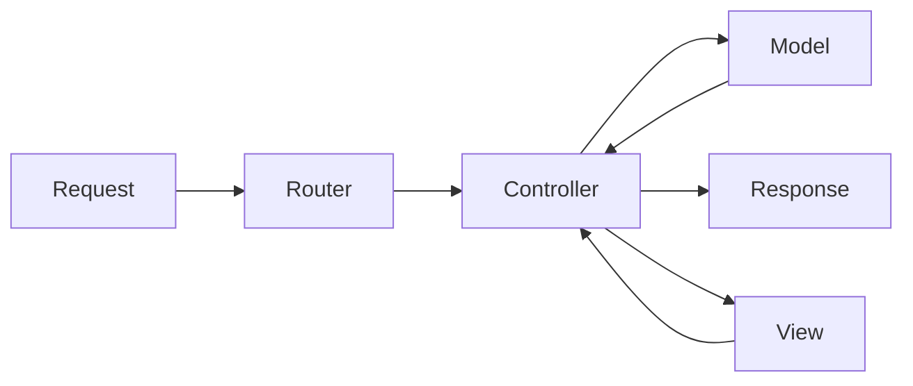

# Node.js, Express, MongoDB & More: The Complete Bootcamp 2023

## 8. Section 8: Using MongoDB with Mongoose

### 8.82. Section Intro

We will connect to MongoDB from our app using Mongoose.

### 8.83. Connecting Our Database with the Express App

We will get our connection string from MongoDB Atlas. We can use the `Connect`page of the cluster and select the application connection.

We will get the connection string from the `Connect your application` section.

```bash
mongodb+srv://hcanercan:<password>@cluster0.8cjdopq.mongodb.net/?retryWrites=true&w=majority
```

On the config.env file we will add the connection string, username and password:

```bash
NODE_ENV = development
PORT = 8000
DATABASE_PASSWORD=XXX
DATABASE_USERNAME=XXX
DATABASE=mongodb+srv://<USERNAME>:<PASSWORD>@cluster0.8cjdopq.mongodb.net/natours?retryWrites=true&w=majority
```

On the server.js file we will connect to the database:

```js
const mongoose = require("mongoose");
const dotenv = require("dotenv");

dotenv.config({ path: "./config.env" });

const app = require("./app");

const DB = process.env.DATABASE.replace(
  "<PASSWORD>",
  process.env.DATABASE_PASSWORD
).replace("<USERNAME>", process.env.DATABASE_USERNAME);

mongoose
  .connect(DB, {
    useNewUrlParser: true,
    useCreateIndex: true,
    useFindAndModify: false,
  })
  .then(() => {
    console.log("DB connection successful!");
  });

const port = process.env.PORT || 3000;
app.listen(port, () => {
  console.log(`App running on port ${port}...`);
});
```

We should see the success message on the console. On the connection string we are replacing the password and username with the environment variables.

### 8.84. What is Mongoose

- Mongoose is an Object Data Modeling (ODM) library for MongoDB and Node.js, it provides higher level of abstraction.
- Mongoose allows for rapid and simple development of mongoDB database interactions.
- Features: schemas to model data and relationships, easy data validation, simple query API, middleware, etc.
- Mongoose schema: where we model our data, by describing the structure of the data, default values, and validation.
- Mongoose model: a wrapper for the schema, providing an interface to the database for CRUD operations.

### 8.85. Creating a Simple Tour Model

We will define the tour model:

```js
const tourSchema = new mongoose.Schema({
  name: {
    type: String,
    required: [true, "A tour must have a name"],
    unique: true,
  },
  rating: {
    type: Number,
    default: 4.5,
  },
  price: {
    type: Number,
    required: [true, "A tour must have a price"],
  },
});

//we use uppercase for model names
const Tour = mongoose.model("Tour", tourSchema);
```

In this example we have used validators and several configurations for the entity properties.

### 8.86. Creating Documents and Testing the Model

We are going to create a document and test the model:

```js
const mongoose = require("mongoose");
const dotenv = require("dotenv");

dotenv.config({ path: "./config.env" });

const app = require("./app");

const DB = process.env.DATABASE.replace(
  "<PASSWORD>",
  process.env.DATABASE_PASSWORD
).replace("<USERNAME>", process.env.DATABASE_USERNAME);

mongoose
  .connect(DB, {
    useNewUrlParser: true,
    useCreateIndex: true,
    useFindAndModify: false,
  })
  .then(() => {
    console.log("DB connection successful!");
  });

const tourSchema = new mongoose.Schema({
  name: {
    type: String,
    required: [true, "A tour must have a name"],
    unique: true,
  },
  rating: {
    type: Number,
    default: 4.5,
  },
  price: {
    type: Number,
    required: [true, "A tour must have a price"],
  },
});

//we use uppercase for model names
const Tour = mongoose.model("Tour", tourSchema);

const testTour = new Tour({
  name: "The Forest Hiker",
  rating: 4.7,
  price: 497,
});

testTour
  .save()
  .then((doc) => {
    console.log(doc);
    console.log("Document saved!");
  })
  .catch((err) => {
    console.log("ERROR: ", err);
  });
```

In this if we run `npm start` once we will see the saved document on the MongoDB collection. Previously we deleted the collection and the documents. When we run this file and save the document MongoDB will create the collection and save the document.

If we pay attention to schema we can see that we have defined the `name` property as unique. If we try to save a document with the same name we will get an error. We can also see that we have defined the `price` property as required. If we try to save a document without the price we will get an error.

### 8.87. Intro to Back-End Architecture: MVC, Types of Logic, and More

MVC is a software design pattern that separates the application into three main logical components:

- Model: Business Logic
- View: Presentation Logic
- Controller: Application Logic

The model is the data, the view is the presentation of the data, and the controller is the logic that decides what the user sees and does.



Application Logic

- Code that is concerned about the applications's implementation, not the underlying business problem we're trying to solve(e.g. showing and selling tours).
- Concerned about managing requests and responses.
- About the app's more technical aspects.
- Bridge between model and view layers.

Business Logic

- Code that actually solves the business problem we set out to solve.
- Directly related to business rules how the business works, and business needs.
- Examples:
  - Creating new tours in the database
  - Checking if user's password is correct
  - Validating user input data
  - Ensuring only users who bought a tour can review it.

Fat model/thin controller: offload as much logic as possible from the controller and into the model, and keep the controllers as simple as possible.

### 8.88. Refactoring the MVC

We will remove all `fs` related code and add a models folder Tour model to our project.

tourModel.js:

```js
const mongoose = require('mongoose');

const tourSchema = new mongoose.Schema({
  name: {
    type: String,
    required: [true, 'A tour must have a name'],
    unique: true,
  },
  rating: {
    type: Number,
    default: 4.5,
  },
  price: {
    type: Number,
    required: [true, 'A tour must have a price'],
  },
});

//we use uppercase for model names
const Tour = mongoose.model('Tour', tourSchema);

module.exports = Tour;
```

Our folder structure should look like this:

```bash
.
├── app.js
├── config.env
├── controllers
│   ├── tourController.js
│   └── userController.js
├── models
│   └── tourModel.js
├── package-lock.json
├── package.json
├── routes
│   ├── tourRoutes.js
│   └── userRoutes.js
└── server.js
```

Our controller doesn't return data:

```js
exports.getTour = (req, res) => {
  res.status(200).json({
    status: 'success',
    requestedAt: req.requestTime,
    id: req.params.id,
    /*
    data: {
      tour: tour,
    },
    */
  });
};
```
