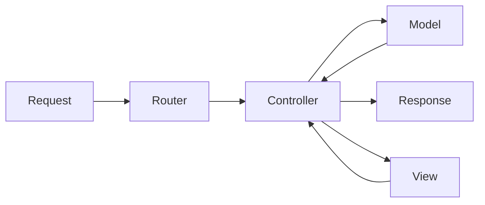

# Node.js, Express, MongoDB & More: The Complete Bootcamp 2023

## 8. Section 8: Using MongoDB with Mongoose

### 8.82. Section Intro

We will connect to MongoDB from our app using Mongoose.

### 8.83. Connecting Our Database with the Express App

We will get our connection string from MongoDB Atlas. We can use the `Connect`page of the cluster and select the application connection.

We will get the connection string from the `Connect your application` section.

```bash
mongodb+srv://hcanercan:<password>@cluster0.8cjdopq.mongodb.net/?retryWrites=true&w=majority
```

On the config.env file we will add the connection string, username and password:

```bash
NODE_ENV = development
PORT = 8000
DATABASE_PASSWORD=XXX
DATABASE_USERNAME=XXX
DATABASE=mongodb+srv://<USERNAME>:<PASSWORD>@cluster0.8cjdopq.mongodb.net/natours?retryWrites=true&w=majority
```

On the server.js file we will connect to the database:

```js
const mongoose = require("mongoose");
const dotenv = require("dotenv");

dotenv.config({ path: "./config.env" });

const app = require("./app");

const DB = process.env.DATABASE.replace(
  "<PASSWORD>",
  process.env.DATABASE_PASSWORD
).replace("<USERNAME>", process.env.DATABASE_USERNAME);

mongoose
  .connect(DB, {
    useNewUrlParser: true,
    useCreateIndex: true,
    useFindAndModify: false,
  })
  .then(() => {
    console.log("DB connection successful!");
  });

const port = process.env.PORT || 3000;
app.listen(port, () => {
  console.log(`App running on port ${port}...`);
});
```

We should see the success message on the console. On the connection string we are replacing the password and username with the environment variables.

### 8.84. What is Mongoose

- Mongoose is an Object Data Modeling (ODM) library for MongoDB and Node.js, it provides higher level of abstraction.
- Mongoose allows for rapid and simple development of mongoDB database interactions.
- Features: schemas to model data and relationships, easy data validation, simple query API, middleware, etc.
- Mongoose schema: where we model our data, by describing the structure of the data, default values, and validation.
- Mongoose model: a wrapper for the schema, providing an interface to the database for CRUD operations.

### 8.85. Creating a Simple Tour Model

We will define the tour model:

```js
const tourSchema = new mongoose.Schema({
  name: {
    type: String,
    required: [true, "A tour must have a name"],
    unique: true,
  },
  rating: {
    type: Number,
    default: 4.5,
  },
  price: {
    type: Number,
    required: [true, "A tour must have a price"],
  },
});

//we use uppercase for model names
const Tour = mongoose.model("Tour", tourSchema);
```

In this example we have used validators and several configurations for the entity properties.

### 8.86. Creating Documents and Testing the Model

We are going to create a document and test the model:

```js
const mongoose = require("mongoose");
const dotenv = require("dotenv");

dotenv.config({ path: "./config.env" });

const app = require("./app");

const DB = process.env.DATABASE.replace(
  "<PASSWORD>",
  process.env.DATABASE_PASSWORD
).replace("<USERNAME>", process.env.DATABASE_USERNAME);

mongoose
  .connect(DB, {
    useNewUrlParser: true,
    useCreateIndex: true,
    useFindAndModify: false,
  })
  .then(() => {
    console.log("DB connection successful!");
  });

const tourSchema = new mongoose.Schema({
  name: {
    type: String,
    required: [true, "A tour must have a name"],
    unique: true,
  },
  rating: {
    type: Number,
    default: 4.5,
  },
  price: {
    type: Number,
    required: [true, "A tour must have a price"],
  },
});

//we use uppercase for model names
const Tour = mongoose.model("Tour", tourSchema);

const testTour = new Tour({
  name: "The Forest Hiker",
  rating: 4.7,
  price: 497,
});

testTour
  .save()
  .then((doc) => {
    console.log(doc);
    console.log("Document saved!");
  })
  .catch((err) => {
    console.log("ERROR: ", err);
  });
```

In this if we run `npm start` once we will see the saved document on the MongoDB collection. Previously we deleted the collection and the documents. When we run this file and save the document MongoDB will create the collection and save the document.

If we pay attention to schema we can see that we have defined the `name` property as unique. If we try to save a document with the same name we will get an error. We can also see that we have defined the `price` property as required. If we try to save a document without the price we will get an error.

### 8.87. Intro to Back-End Architecture: MVC, Types of Logic, and More

MVC is a software design pattern that separates the application into three main logical components:

- Model: Business Logic
- View: Presentation Logic
- Controller: Application Logic

The model is the data, the view is the presentation of the data, and the controller is the logic that decides what the user sees and does.



Application Logic

- Code that is concerned about the applications's implementation, not the underlying business problem we're trying to solve(e.g. showing and selling tours).
- Concerned about managing requests and responses.
- About the app's more technical aspects.
- Bridge between model and view layers.

Business Logic

- Code that actually solves the business problem we set out to solve.
- Directly related to business rules how the business works, and business needs.
- Examples:
  - Creating new tours in the database
  - Checking if user's password is correct
  - Validating user input data
  - Ensuring only users who bought a tour can review it.

Fat model/thin controller: offload as much logic as possible from the controller and into the model, and keep the controllers as simple as possible.

### 8.88. Refactoring the MVC

We will remove all `fs` related code and add a models folder Tour model to our project.

tourModel.js:

```js
const mongoose = require("mongoose");

const tourSchema = new mongoose.Schema({
  name: {
    type: String,
    required: [true, "A tour must have a name"],
    unique: true,
  },
  rating: {
    type: Number,
    default: 4.5,
  },
  price: {
    type: Number,
    required: [true, "A tour must have a price"],
  },
});

//we use uppercase for model names
const Tour = mongoose.model("Tour", tourSchema);

module.exports = Tour;
```

Our folder structure should look like this:

```bash
.
├── app.js
├── config.env
├── controllers
│   ├── tourController.js
│   └── userController.js
├── models
│   └── tourModel.js
├── package-lock.json
├── package.json
├── routes
│   ├── tourRoutes.js
│   └── userRoutes.js
└── server.js
```

Our controller doesn't return data:

```js
exports.getTour = (req, res) => {
  res.status(200).json({
    status: "success",
    requestedAt: req.requestTime,
    id: req.params.id,
    /*
    data: {
      tour: tour,
    },
    */
  });
};
```

### 8.89. Another Way of Creating Documents

We will create a new document using the `create` method of the model:

```js
exports.createTour = async (req, res) => {
  try {
    const newTour = await Tour.create(req.body);

    res.status(201).json({
      status: "success",
      data: {
        tour: newTour,
      },
    });
  } catch (error) {
    res.status(400).json({
      status: "fail",
      message: error,
    });
  }
};
```

We can return the created document in the response. Additionally we can use the `try/catch` block to handle errors and return a response with the error message.

### 8.90. Reading Documents

We will read documents from the database with the following code:

```js
exports.getAllTours = async (req, res) => {
  try {
    const tours = await Tour.find();
    res.status(200).json({
      status: "success",
      requestedAt: req.requestTime,
      results: tours.length,
      data: {
        tours,
      },
    });
  } catch (error) {
    res.status(404).json({
      status: "fail",
      message: error,
    });
  }
};

exports.getTour = async (req, res) => {
  try {
    const tour = await Tour.findById(req.params.id);
    res.status(200).json({
      status: "success",
      requestedAt: req.requestTime,
      data: {
        tour,
      },
    });
  } catch (error) {
    res.status(404).json({
      status: "fail",
      message: error,
    });
  }
};
```

`Tour.find()` returns all documents from the collection. `Tour.findById()` returns a document with the specified id, it is the same as `Tour.findOne({ _id: req.params.id })`.

### 8.91. Updating Documents

We will use the following code to update documents:

```js
exports.updateTour = async (req, res) => {
  try {
    const tour = await Tour.findByIdAndUpdate(req.params.id, req.body, {
      new: true,
      runValidators: true,
    });
    res.status(200).json({
      status: "success",
      data: {
        tour,
      },
    });
  } catch (error) {
    res.status(400).json({
      status: "fail",
      message: error,
    });
  }
};
```

`Tour.findByIdAndUpdate()` updates the document with the specified id. The third parameter is an object with options. `new: true` returns the updated document. `runValidators: true` runs the validators defined in the schema.

### 8.92. Deleting Documents

We will use the following code to delete documents:

```js
exports.deleteTour = async (req, res) => {
  try {
    await Tour.findByIdAndDelete(req.params.id);
    res.status(200).json({
      status: "success",
      data: null,
    });
  } catch (error) {
    return res.status(400).json({
      status: "fail",
      message: error,
    });
  }
};
```

`Tour.findByIdAndDelete()` deletes the document with the specified id, as a common practice we return `null` in the response.

### 8.93. Modeling the Tours

We have changed the schema of the Tour model:

```js
const tourSchema = new mongoose.Schema({
  name: {
    type: String,
    required: [true, "A tour must have a name"],
    unique: true,
    trim: true,
  },
  duration: {
    type: Number,
    required: [true, "A tour must have a duration"],
  },
  maxGroupSize: {
    type: Number,
    required: [true, "A tour must have a group size"],
  },
  difficulty: {
    type: String,
    required: [true, "A tour must have a difficulty"],
  },
  ratingsAverage: {
    type: Number,
    default: 4.5,
  },
  ratingsQuantity: {
    type: Number,
    default: 0,
  },
  price: {
    type: Number,
    required: [true, "A tour must have a price"],
  },
  priceDiscount: Number,
  summary: {
    type: String,
    trim: true,
    required: [true, "A tour must have a description"],
  },
  description: {
    type: String,
    trim: true,
  },
  imageCover: {
    type: String,
    required: [true, "A tour must have a cover image"],
  },
  images: [String],
  createdAt: {
    type: Date,
    default: Date.now(),
  },
  startDates: [Date],
});
```

We have added new fields to the schema. We have also added validators to some fields.

### 8.94. Importing Development Data

We will import the development data using the following code:

```js
const mongoose = require("mongoose");
const dotenv = require("dotenv");
const fs = require("fs");
const Tour = require("../../models/tourModel");

dotenv.config({ path: "./../../config.env" });

const DB = process.env.DATABASE.replace(
  "<PASSWORD>",
  process.env.DATABASE_PASSWORD
).replace("<USERNAME>", process.env.DATABASE_USERNAME);

mongoose
  .connect(DB, {
    useNewUrlParser: true,
    useCreateIndex: true,
    useFindAndModify: false,
  })
  .then(() => {
    console.log("DB connection successful!");
  });

const deleteData = async () => {
  try {
    await Tour.deleteMany();
    console.log("Deleted all tours!");
    process.exit();
  } catch (error) {
    console.log(error);
  }
};

const importData = async () => {
  const fileContent = fs.readFileSync(
    `${__dirname}/tours-simple.json`,
    "utf-8"
  );
  const tours = JSON.parse(fileContent);
  try {
    await Tour.create(tours);
    console.log("Data successfully loaded!");
    process.exit();
  } catch (err) {
    console.log(err);
  }
};

if (process.argv[2] === "--import") {
  importData();
} else if (process.argv[2] === "--delete") {
  deleteData();
}
```

We can run the script with the following command:

for deleting all documents:

```bash
node dev-data/data/import-dev-data.js --delete
```

for importing the development data:

```bash
node dev-data/data/import-dev-data.js --import
```

### 8.95. Making the API Better: Filtering

We will use the following code to filter the documents:

```js
exports.getAllTours = async (req, res) => {
  console.log(req.query);
  try {
    const queryObj = { ...req.query };
    const excludedFields = ["page", "sort", "limit", "fields"];
    excludedFields.forEach((el) => delete queryObj[el]);
    console.log(req.query, queryObj);
    const tours = await Tour.find(queryObj);
    res.status(200).json({
      status: "success",
      requestedAt: req.requestTime,
      results: tours.length,
      data: {
        tours,
      },
    });
  } catch (error) {
    res.status(404).json({
      status: "fail",
      message: error,
    });
  }
};
```

If we access the following url:

```bash
http://localhost:{{PORT}}/api/v1/tours?duration=5&difficulty=easy&sort=1&limit=10
```

We can see the following output:

```bash
{ duration: '5', difficulty: 'easy', sort: '1', limit: '10' }
{ duration: '5', difficulty: 'easy' }
```

Mongoose will apply the remaining query parameters to the query.

```js
const tours = await Tour.find({
  duration: 5,
  difficulty: "easy",
});

const tours = await Tour.find()
  .where("duration")
  .equals(5)
  .where("difficulty")
  .equals("easy");
```

These lines could give the same result.

### 8.96. Making the API Better: Advanced Filtering

We will use the following code to filter the documents:

```js
exports.getAllTours = async (req, res) => {
  console.log(req.query);
  try {
    const queryObj = { ...req.query };
    const excludedFields = ['page', 'sort', 'limit', 'fields'];
    excludedFields.forEach((el) => delete queryObj[el]);

    let queryStr = JSON.stringify(queryObj);
    queryStr = queryStr.replace(/\b(gte|gt|lte|lt)\b/g, (match) => `$${match}`);
    console.log(queryStr);

    const query = Tour.find(JSON.parse(queryStr));
    const tours = await query;

    res.status(200).json({
      status: 'success',
      requestedAt: req.requestTime,
      results: tours.length,
      data: {
        tours,
      },
    });
  } catch (error) {
    res.status(404).json({
      status: 'fail',
      message: error,
    });
  }
};
```

We need to translate the request query to a mongoose query. We can use the following code to do that:

```js
queryStr = queryStr.replace(/\b(gte|gt|lte|lt)\b/g, (match) => `$${match}`);
```

We can use the following url to test the code:

```bash
http://localhost:{{PORT}}/api/v1/tours?duration[gte]=5&difficulty=easy&sort=1&limit=10&price[lt]=1500
```

The replace method will put a dollar sign before the operators for the mongoose query.

For real world applications we need to define documentation for the API.

### 8.97. Making the API Better: Sorting