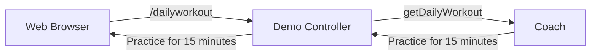
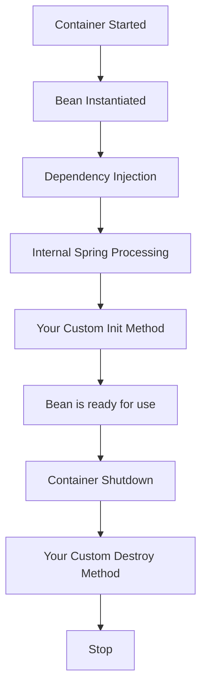

# [NEW] Spring Boot 3 Spring 6 and Hibernate for Beginners

## Section 2: NEW - Spring Core

### 33. What is Inversion of Control

Inversion of Control: The approach of outsourcing the construction and management of objects.

Spring Container

The Spring container is responsible for instantiating, configuring and assembling objects.

For example my app will request a "Coach" object and the Spring container will provide the "Coach".

Spring Container Primary Functions:

- Create and manage objects (Inversion of Control)
- Inject object dependencies (Dependency Injection)

Configuring Spring Container

- XML configuration file (legacy) we will not use this
- Java Annotations (modern)
- Java Source Code (modern)

### 34. Defining Dependency Injection - Overview - Part 1

Dependency Injection

The dependency inversion principle. The client delegates the another the responsibility of providing its dependencies.

Spring Container

Give me a assembled "Coach" object with all dependencies injected.

Some helper objects (dependencies):

- Give me a "Coach" object
  - CricketCoach
  - HockeyCoach
  - BaseballCoach

Injection Types: There are multiple types of injection with Spring

- Constructor Injection
  - Use this when you have required dependencies
  - Generally recommended by the Spring team
- Setter Injection
  - Use this when you have optional dependencies
  - If dependency is not provided, your app can provide reasonable default logic

What is Spring AutoWiring?

Spring will look for a class that matches , matches by class of interface. Spring will inject it automatically.

AutoWiring Example

- Inject a Coach implementation
- Spring will scan for @Components
- Any ıne implements the Coach interface?
- If so, let's inject it, for example: CricketCoach

### 35. Defining Dependency Injection - Overview - Part 2



Development Process

1. Define the dependency interface and class
2. Create a Demo rest Controller
3. Create a constructor in your class for injections
4. Add @GetMapping method to expose the endpoint

Step 1: Define the dependency interface and class

Coach.java
```java
package com.luv2code.springcoredemo;

public interface Coach {
    public String getDailyWorkout();
}
```

CrickeCoach.java
```java
package com.luv2code.springcoredemo;

import org.springframework.stereotype.Component;

@Component
public class CricketCoach implements Coach {
    @Override
    public String getDailyWorkout() {
        return "Practice fast bowling for 15 minutes";
    }
}
```

@Componenet annotation:

- Marks the class as a Spring Bean.
- makes the bean available for dependency injection.

DemoController.java
```java
package com.luv2code.springcoredemo;

import org.springframework.beans.factory.annotation.Autowired;
import org.springframework.web.bind.annotation.GetMapping;

@RestContoller
public class DemoController {
    private Coach myCoach;

    @Autowired
    public DemoController(Coach theCoach) {
        myCoach = theCoach;
    }

    @GetMapping("/dailyworkout")
    public String getDailyWorkout() {
        return myCoach.getDailyWorkout();
    }
}
```

If you have only one constructor, @Autowired is optional.

### 36. Constructor Injection - Coding - Part 1

This part is about some file copy paste. I will not write it here.

### 37. Constructor Injection - Coding - Part 2

@Component annotation is used to mark the class as a Spring Bean, it makes the bean available for dependency injection.

### 38. IDE Warning - No Usages

Spring is dynamically injecting the dependency. So, the IDE cannot find the usage of the class. It is normal.

### 39. Constructor Injection - Behind the Scenes

Coach.java
```java
package com.luv2code.springcoredemo;

public interface Coach {
    public String getDailyWorkout();
}
```

CrickeCoach.java
```java
package com.luv2code.springcoredemo;

@Component
public class CricketCoach implements Coach {
    @Override
    public String getDailyWorkout() {
        return "Practice fast bowling for 15 minutes";
    }
}
```

DemoController.java
```java
package com.luv2code.springcoredemo;

@RestController
public class DemoController {
    private Coach myCoach;

    @Autowired
    public DemoController(Coach theCoach) {
        myCoach = theCoach;
    }
}
```

Spring Framework handles the constructor injection behind the scenes. It creates the object and injects the dependency.

```java
Coach theCoach = new CricketCoach();
DemoController theController = new DemoController(theCoach);
```

The "new" keyword is that it?

- Spring is more than just Inversion of Control and Dependency Injection.
- For small basic apps, it may be hard to see the benefits of Spring.

Spring for Enterprise Applications

- Spring is targeted for enterprise, real-time / real-world applications.
- Spring provides features such as
  - Database access and Transactions
  - REST API and Web MVC
  - Security

### 40. Component Scanning - Overview

Spring will scan java classes for special annotations and automatically register the beans in the Spring container.

SpringcoredemoApplication.java
```java
package com.luv2code.springcoredemo;

import org.springframework.boot.SpringApplication;
import org.springframework.boot.autoconfigure.SpringBootApplication;

@SpringBootApplication
public class SpringcoredemoApplication {
    public static void main(String[] args) {
        SpringApplication.run(SpringcoredemoApplication.class, args);
    }
}
```

@SpringBootApplication annotation enables

- Auto-configuration
- Component scanning
- Additional configuration

It is composed of following annotations:

- @EnableAutoConfiguration: Enables Spring Boot's auto-configuration mechanism.
- @ComponentScan: Enables component scanning of current package and sub-packages.
- @Configuration: Able to register extra beans with @Bean or import other configuration classes.

Common Pitfall - Different location: By default, Spring Boot will not component scan these packages. Only package of main Spring Boot application class and sub-packages. You can add @ComponentScan annotation to the main Spring Boot application class.

```java
@SpringBootApplication(
    scanBasePackages = {
        "com.luv2code.springcoredemo",
        "com.luv2code.util",
        "org.acme.cart"
    }
)
```

### 41. Component Scanning - Coding - Part 1

This part is about some file copy paste. I will not write it here.

### 42. Component Scanning - Coding - Part 2

If we create a new package under the main java package, Spring will not scan it. We need to add @ComponentScan annotation to the main Spring Boot application class.

We can add the package name to the @ComponentScan annotation.

```java
@SpringBootApplication(
    scanBasePackages = {
        "com.luv2code.springcoredemo",
        "com.luv2code.util",
        "org.acme.cart"
    }
)
```

### 43. Setter Injection - Overview

Spring injection types:

- Constructor Injection
- Setter Injection

Setter Injection

Inject dependencies by calling setter methods on your beans.

AutoWiring Example

- Injecting a Coach implementation
- Spring will scan for @Components
- Any one implements the Coach interface?
- If so, let's inject it, for example: CricketCoach

Development Process - Setter Injection

1. Create setter methods in your class for injections
2. Configure the dependency injection with @Autowired annotation

DemoController.java

```java
@RestController
public class DemoController {
    private Coach myCoach;

    @Autowired
    public void setMyCoach(Coach theCoach) {
        myCoach = theCoach;
    }
}
```

Spring Framework

```java
Coach theCoach = new CricketCoach();
DemoController theController = new DemoController();
theController.setMyCoach(theCoach);
```

We can inject dependencies by calling any method on our class.

Injection Types - Which one to use?

- Constructor Injection
  - Use this when you have required dependencies
  - Generally recommended by the Spring team
- Setter Injection
  - Use this when you have optional dependencies
  - If dependency is not provided, your app can provide reasonable default logic

### 44. Setter Injection - Coding

Setter injection will work:

```java
@RestController
public class DemoController {
    private Coach myCoach;

    @Autowired
    public void setMyCoach(Coach theCoach) {
        myCoach = theCoach;
    }
}
```

Also any method can be used for injection.

```java
@RestController
public class DemoController {
    private Coach myCoach;

    @Autowired
    public void doSomeStuff(Coach theCoach) {
        myCoach = theCoach;
    }
}
```

### 45. Field Injection

Recommended by the spring.io development team

- Constructor Injection: required dependencies
- Setter Injection: optional dependencies

Not recommended by the spring.io development team

- Field Injection

Field injection is not recommended by the Spring team in modern Spring applications. It is mostly used in legacy code.

### 46. Qualifiers - Overview

If there is more than one implementation of an interface, Spring will not know which one to inject.

```java
public interface Coach {
    public String getDailyWorkout();
}
```

```java
@Component
public class CricketCoach implements Coach {
    @Override
    public String getDailyWorkout() {
        return "Practice fast bowling for 15 minutes";
    }
}
```

```java
@Component
public class BaseballCoach implements Coach {
    @Override
    public String getDailyWorkout() {
        return "Spend 30 minutes on batting practice";
    }
}
```

We need to be more specific about which implementation to inject.

```java
@RestController
public class DemoController {
    private Coach myCoach;

    @Autowired
    public void setMyCoach(@Qualifier("cricketCoach") Coach theCoach) {
        myCoach = theCoach;
    }
}
```

Setter example:

```java
@RestController
public class DemoController {
    private Coach myCoach;

    @Autowired
    public void setMyCoach(@Qualifier("cricketCoach") Coach theCoach) {
        myCoach = theCoach;
    }
}
```

### 47. Qualifiers - Coding - Part 1

I will not write this part here. Same changes are made in the code.

### 48. Qualifiers - Coding - Part 2

```java
@Autowired
public void setMyCoach(@Qualifier("cricketCoach") Coach theCoach) {
    myCoach = theCoach;
}
```

Same name as class, first letter is lowercase.

### 49. Primary - Overview

We have alternative to the @Qualifier annotation.

We have multiple implementations of an interface.

```java
@Component
public class CricketCoach implements Coach {
...
}

@Component
public class BaseballCoach implements Coach {
...
}

@Component
public class HockeyCoach implements Coach {
...
}
```

Primary annotation use case:

```java
@Component
@Primary
public class CricketCoach implements Coach {
    @Override
    public String getDailyWorkout() {
        return "Practice fast bowling for 15 minutes";
    }
}
```

If we use the @Primary annotation, we don't have to add the @Qualifier annotation.

```java
@RestController
public class DemoController {
    private Coach myCoach;

    @Autowired
    public void setMyCoach(Coach theCoach) {
        myCoach = theCoach;
    }
}
```

We can use use @Primary annotation for only one class.

We can mix @Primary and @Qualifier annotations. @Qualifier will override @Primary.

In general using @Qualifier is more beneficial.

- More specific
- Higher priority

### 50. Primary - Coding

We can use @Primary annotation for only one class.

```java
@Component
@Primary
public class CricketCoach implements Coach {
    @Override
    public String getDailyWorkout() {
        return "Practice fast bowling for 15 minutes";
    }
}
```

If we use more than one we will get a unsatisfied dependency injection error.

### 51. Lazy Initialization - Overview

- By default when our application starts all beans are initialized.
- Spring will create an instance of each and make them available.

We can add some diagnostics to see the bean creation.

```java
@Component
public class CricketCoach implements Coach {
    public CricketCoach() {
        System.out.println("In constructor: " + getClass().getSimpleName());
    }
}
```

```java
@Component
public class BaseballCoach implements Coach {
    public BaseballCoach() {
        System.out.println("In constructor: " + getClass().getSimpleName());
    }
}
```

```java
@Component
public class TrackCoach implements Coach {
    public TrackCoach() {
        System.out.println("In constructor: " + getClass().getSimpleName());
    }
}
```

```java
@Component
public class TennisCoach implements Coach {
    public TennisCoach() {
        System.out.println("In constructor: " + getClass().getSimpleName());
    }
}
```

When we start the application we will see something like this:

```console
In constructor: CricketCoach
In constructor: BaseballCoach
In constructor: TrackCoach
In constructor: TennisCoach
```

Lazy Initialization

- Instead of creating all beans up front, we can specify lacy initialization.
- A bean will only be initialized in the following cases:
  - It is needed for dependency injection
  - Or it is explicitly requested

Giving @Lazy annotation to the class will make it lazy.

Global Configuration

```properties
spring.main.lazy-initialization=true
```

All beans will be lazy initialized.

After adding the @Lazy annotation:

```java
@Component
@Lazy
public class CricketCoach implements Coach {
    public CricketCoach() {
        System.out.println("In constructor: " + getClass().getSimpleName());
    }
}
```

```java
@RestContoller
public class DemoController {
    private Coach myCoach;

    @Autowired
    public DemoController(@Qualifier("cricketCoach") Coach theCoach) {
        System.out.println("In constructor: " + getClass().getSimpleName());
        myCoach = theCoach;
    }
}
```

When we start the application we will see something like this:

```console
In constructor: CricketCoach
In constructor: DemoController
```

Lazy Initialization Advantages

- Only create beans when needed
- May help with faster startup time if you have large number of components

Disadvantages

- If you have web related components like @RestController, not created until requested
- May not discover configuration issues until too late
- need to make sure have enough memory to handle the beans when they are created

### 52. Lazy Initialization - Coding - Part 1

I will not write this part here. Same changes are made in the code.

### 53. Lazy Initialization - Coding - Part 2

```java
@Component
@Lazy
public class CricketCoach implements Coach {
    public CricketCoach() {
        System.out.println("In constructor: " + getClass().getSimpleName());
    }
}
```

After adding the @Lazy annotation we will not see the bean creation log on the console.

If we add the global configuration:

```properties
spring.main.lazy-initialization=true
```

With the below controller:

```java
@RestContoller
public class DemoController {
    private Coach myCoach;

    @Autowired
    public DemoController(@Qualifier("cricketCoach") Coach theCoach) {
        System.out.println("In constructor: " + getClass().getSimpleName());
        myCoach = theCoach;
    }
}
```

We will not see the unused beans on the console. It will create this log:

```console
In constructor: CricketCoach
In constructor: DemoController
```

### 54. Bean Scopes - Overview

Bean Scope 

- Scope refers to lifecycle of a bean
- How long does the bean live?
- How many instances are created?
- How is the bean shared?

Default Scope: Default scope is Singleton

- Singleton: Spring container creates only one instance of the bean
- It is cached in memory
- All dependency injections will point to the same object

An example of Singleton Scope

```java
@RestController
public class DemoController {
    private Coach myCoach;
    private Coach anotherCoach;

    @Autowired
    public DemoController(
        @Qualifier("cricketCoach") Coach theCoach,
        @Qualifier("cricketCoach") Coach theAnotherCoach
    ) {
        myCoach = theCoach;
        anotherCoach = theAnotherCoach;
    }
}
```

Both point the same instance.

We can explicitly define the scope of a bean with the @Scope annotation.

```java
@Component
@Scope(ConfigurableBeanFactory.SCOPE_SINGLETON)
public class CricketCoach implements Coach {
    ...
}
```

Additional Bean Scopes

- singleton: Create a single shared instance of the bean. Default scope.
- prototype: Create a new bean instance for each container request.
- request: Scoped to an HTTP web request. Only used for web apps.
- session: Scoped to an HTTP web session. Only used for web apps.
- global-session: Scoped to a global HTTP web session. Only used for web apps.

Prototype scope

```java
@Component
@Scope(ConfigurableBeanFactory.SCOPE_PROTOTYPE)
public class CricketCoach implements Coach {
    ...
}
```

Check the bean scope with the below code:

```java
@Component
public class DemoController {
    private Coach myCoach;
    private Coach anotherCoach;

    @Autowired
    public DemoController(
        @Qualifier("cricketCoach") Coach theCoach,
        @Qualifier("cricketCoach") Coach theAnotherCoach
    ) {
        myCoach = theCoach;
        anotherCoach = theAnotherCoach;
    }

    @GetMapping("/check")
    public String check() {
        return "Comparing beans: myCoach == anotherCoach: " + (myCoach == anotherCoach);
    }
}
```

For the check method:

- Singleton: True
- Prototype: False

Prototype will create a new instance for each request.

### 55. Bean Scopes - Coding

I will not write this part here. Same changes are made in the code.

### 56. Bean Lifecycle Methods - Overview



Bean Lifecycle Methods / Hooks

- We can add custom code during bean initialization
  - Calling custom business logic methods
  - Setting up handles to resources (db, sockets, file, etc.)

- You can add custom code during bean destruction
  - Calling custom business logic methods
  - Clean up handles to resources (db, sockets, file, etc.)

Init and destroy method example

```java
@Component
public class CricketCoach implements Coach {
    public CricketCoach() {
        System.out.println("In constructor: " + getClass().getSimpleName());
    }

    @PostConstruct
    public void doMyStartupStuff() {
        System.out.println("In doMyStartupStuff()");
    }

    @PreDestroy
    public void doMyCleanupStuff() {
        System.out.println("In doMyCleanupStuff()");
    }
}
```

### 57. Bean Lifecycle Methods - Coding

I will not write this part here. Same changes are made in the code.

