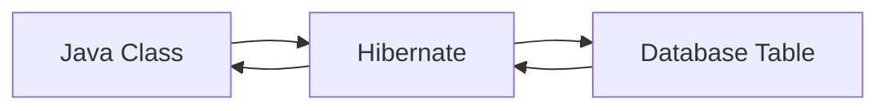
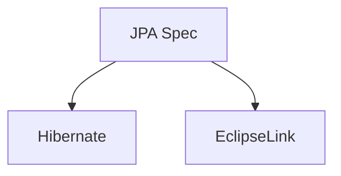
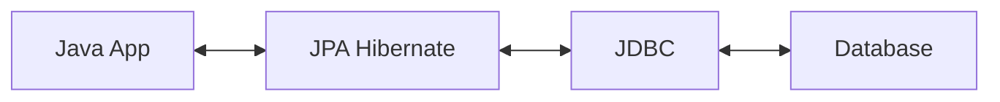
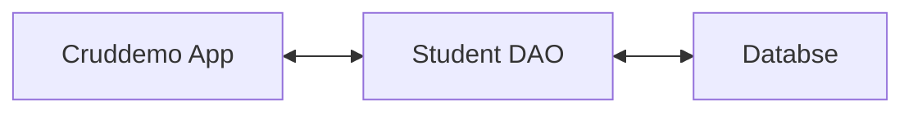
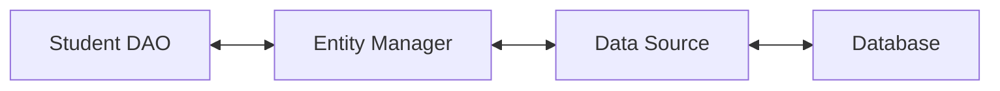

# [NEW] Spring Boot 3 Spring 6 and Hibernate for Beginners

## Section 3: NEW - Hibernate / JPA CRUD

### 62. Hibernate / JPA Overview

- What is Hibernate?
- Benefits of Hibernate
- What is JPA?
- Benefits of JPA

Hibernate is a framework for persisting / saving Java objects in a database.

Benefits of Hibernate:

- Handles all of the low-level SQL
- Minimizes the amount of JDBC code you have to develop
- Hibernate provides the Object-to-Relational Mapping (ORM)

Object-To-Relational Mapping (ORM)

- We define the mapping between Java class and database table.



What is JPA?

- Jakarta Persistence API (JPA) is a Java specification for accessing, persisting, and managing data between Java objects / classes and a relational database.
- Standard API for Object-to-Relational Mapping (ORM).
- Only a specification, not an implementation.
  - Defined a set of interfaces
  - Requires an implementation to be usable



What are the benefits of JPA?

- By having a standard API, we are not vendor locked in.
- Maintain portable, flexible code by using JPA interfaces.
- Can theoretically switch vendor implementations:
  - For example, if vendor A stops supporting their product we can switch to vendor B.

Code snippet:

```java
// create Java object
Student theStudent = new Student("Paul", "Wall", "paul@gmail.com");

// save the student
entityManager.persist(theStudent);
```

Old days of JDBC you would have to manually write the SQL code.

Retrieving data:

```java
int theId = 1;
Student theStudent = entityManager.find(Student.class, theId);
```

Querying for Java Objects:

```java
TypedQuery<Student> theQuery = entityManager.createQuery("from Student", Student.class);
List<Student> students = theQuery.getResultList();
```

We will cover CRUD:

- Create
- Read
- Update
- Delete

### 63. Hibernate, JPA and JDBC

Hibernate / JPA uses JDBC for all database interactions.



### 64. Setting Up Development Environment

In this course we will use MySQL database.

- MySQL includes two components:
  - MySQL Server
  - MySQL Workbench

Installing:

- MySQL Server: [link](https://dev.mysql.com/downloads/mysql/)
- MySQL Workbench: [link](https://dev.mysql.com/downloads/workbench/)

### 65. Setting Up Database Table - Overview

01-create-student-table.sql

Creates a new MySQL user for our application.

- user id: springstudent
- password: springstudent

02-create-student-table.sql

Creates a new table in the database.

- id
- first_name
- last_name
- email

01-create-student-table.sql

```sql
-- Drop user first if they exist
DROP USER IF EXISTS 'springstudent'@'localhost';

-- Now create user with prop privileges
CREATE USER 'springstudent'@'localhost' IDENTIFIED BY 'springstudent';

GRANT ALL PRIVILEGES ON * . * TO 'springstudent'@'localhost';
```

After we execute the script it will create a new user and grant them all privileges.

02-create-student-table.sql

```sql
CRETE DATABASE IF NOT EXISTS 'student_tracker';
USE 'student_tracker';

DROP TABLE IF EXISTS 'student';

CREATE TABLE 'student' (
  'id' int(11) NOT NULL AUTO_INCREMENT,
  'first_name' varchar(45) DEFAULT NULL,
  'last_name' varchar(45) DEFAULT NULL,
  'email' varchar(45) DEFAULT NULL,
  PRIMARY KEY ('id')
) ENGINE=InnoDB AUTO_INCREMENT=1 DEFAULT CHARSET=utf8;
```

### 67. Setting Up Spring Boot Project - Overview

Automatic Data Source Configuration

- In Spring Boot, Hibernate is the default implementation of JPA.
- EntityManager is main component for creating queries etc.
- EntityManager is from Jakarta Persistence API (JPA).

Based on configs, Spring Boot will automatically create the beans: DataSource, EntityManagerFactory, ...

You can then inject these into your app, for example your DAO (Data Access Object) classes.

Setting up Project with Spring Initializr

- MySQL Driver: mysql-connector-j
- Spring Data JPA: spring-boot-starter-data-jpa

Spring Boot will automatically configure your data source for you.

application.properties

```properties
spring.datasource.url=jdbc:mysql://localhost:3306/student_tracker
spring.datasource.username=springstudent
spring.datasource.password=springstudent
```

We will start with a Command Line App:

```java
@SpringBootApplication
public class CruddemoApplication {

  public static void main(String[] args) {
    SpringApplication.run(CruddemoApplication.class, args);
  }

  @Bean
  public CommandLineRunner commandLineRunner(String[] args) {
    return runner -> {
      System.out.println("Hello World");
    };
  }
}
```

### 68. Setting Up Spring Boot Project - Coding - Part 1

Java code:
  
```java
@SpringBootApplication
public class CruddemoApplication {
  public static void main(String[] args) {
    SpringApplication.run(CruddemoApplication.class, args);
  }

  @Bean
  public CommandLineRunner commandLineRunner(StudentRepository studentRepository) {
    return runner -> {
      System.out.println("Hello World");
    };
  }
}
```

### 69. Setting Up Spring Boot Project - Coding - Part 2

We need to add properties to application.properties:

```properties
spring.datasource.url=jdbc:mysql://localhost:3306/student_tracker
spring.datasource.username=springstudent
spring.datasource.password=springstudent
```

If we use a wrong URL, username or password we will get an exception.

Side note: We can disable the spring banner by adding `spring.main.banner-mode=off` to application.properties.

We can change the logging level by adding `logging.level.org.springframework=warn` to application.properties.

### 70. JPA Annotations - Overview

Hibernate is the default JPA implementation in Spring Boot.

Entity Class: Java class that is mapped to a database table.


Entity Class

- Must be annotated with @Entity
- Must have a no-arg constructor, the class can have other constructors

Constructor Reminder

- If you don't define any constructors, Java will provide a default no-arg constructor.
- If you declare constructors with arguments, Java will not provide a default no-arg constructor.

Java Annotations

- Step 1: Map class to database table
- Step 2: Map fields to database columns

Java code:

```java
@Entity
@Table(name="student")
public class Student {
  @Id
  @GeneratedValue(strategy=GenerationType.IDENTITY)
  @Column(name="id")
  private int id;

  @Column(name="first_name")
  private String firstName;

  @Column(name="last_name")
  private String lastName;

  @Column(name="email")
  private String email;
}
```

@Column - Optional

- Actually, the use of @Column is optional.
- If not specified, the column name is the same as Java field.
- In general, we shouldn't use this approach.
  - If you refactor the Java code, then it will not match existing database columns.
  - This is a breaking change and you will need to update column.
- Same applies to table name.

Primary Key: Unique identifier for each row in the table. Cannot be null.

ID Generation Strategy

- GenerationType.IDENTITY: Database will automatically generate the primary key.
- GenerationType.SEQUENCE: Database will use a database sequence to generate the primary key.
- GenerationType.TABLE: Database will use a database table to generate the primary key.
- GenerationType.AUTO: Hibernate will choose the generation strategy based on the database.

In addition we can create our own ID generation strategy.

### 71. JPA Annotations - Coding

```java
@Getter
@Setter
@Entity
@Table(name="student")
public class Student {
  @Id
  @GeneratedValue(strategy=GenerationType.IDENTITY)
  @Column(name="id")
  private int id;

  @Column(name="first_name")
  private String firstName;

  @Column(name="last_name")
  private String lastName;

  @Column(name="email")
  private String email;

  public Student() {
  }

  public Student(String firstName, String lastName, String email) {
    this.firstName = firstName;
    this.lastName = lastName;
    this.email = email;
  }
}
```

### 72. Saving a Java Object with JPA - Overview

- Create a new Student
- Read a Student
- Update a Student
- Delete a Student



Student Data Access Object

- Our DAO needs a JPA Entity Manager
- JPA Entity manager is the main component for saving/retrieving entities.

JPA Entity Manager

- Our JPA Entity Manager needs a Data Source
- The Data Source defines database connection info
- JPA Entity Manager and Data Source are automatically created by Spring Boot based on the application.properties file.
- We can autowire/inject the JPA Entity Manager into our Student DAO.



Student DAO

- Step 1: Define DAO interface
- Step 2: Define DAO implementation
  - Inject the entity manager
- Step 3: Update main app

Step 1: Define DAO (Data Access Object) interface

```java
public interface StudentDAO {
  public void saveStudent(Student theStudent);
}
```

Step 2: Define DAO implementation

```java
public class StudentDAOImpl implements StudentDAO {
  private EntityManager entityManager;

  @Autowired
  public StudentDAOImpl(EntityManager entityManager) {
    this.entityManager = entityManager;
  }

  @Override
  @Transactional
  public void save(Student theStudent) {
    entityManager.persist(theStudent);
  }
}
```

Spring @Transactional

- Spring provides an @Transactional annotation.
- Automatically begin and end transaction for your JPA code.
- Transactional means that all operations are performed as a single unit of work.

Specialized Annotations for DAOs

- Spring provides the @Repository annotation.
- Spring will automatically register the DAO implementation as a Spring Bean.
- Spring also provide translation of JPA exceptions to Spring exceptions.

Step 3: Update main app

```java
@SpringBootApplication
public class CruddemoApplication {
  public static void main(String[] args) {
    SpringApplication.run(CruddemoApplication.class, args);
  }

  @Bean
  public CommandLineRunner commandLineRunner(StudentDAO studentDAO) {
    return runner -> {
      createStudent(studentDAO);
    };

  private void createStudent(StudentDAO studentDAO) {
    Student theStudent = new Student("Paul", "Wall", "test@gmail.com");
    studentDAO.save(theStudent);
    System.out.println("Student saved, id: " + theStudent.getId());
  }
}
```

### 73. Saving a Java Object with JPA - Coding - Part 1

Same as previous section.

### 74. Saving a Java Object with JPA - Coding - Part 2

We could check the created student in MySQL Workbench after executing the app.

### 75. Primary Keys

If we add more than one student:

```java
Student theStudent1 = new Student("John", "Doe", "test1@gmail.com");
Student theStudent2 = new Student("Mary", "Public", "test2@gmail.com");
Student theStudent3 = new Student("Bon", "Jovi", "test3@gmail.com");

studentDAO.save(theStudent1);
studentDAO.save(theStudent2);
studentDAO.save(theStudent3);
```

If we check the id values in MySQL Workbench we will see that they are 1, 2, 3.

### 76. Changing Index of MySQL Auto Increment

We can alter the start of auto increment in MySQL Workbench:

```sql
ALTER TABLE student_tracker.student AUTO_INCREMENT = 1000;
```

We can reset the auto increment to 1:

```sql
TRUNCATE TABLE student_tracker.student;
```

### 77. Retrieving Objects with JPA - Overview

We will focus on reading objects.

Java code:

```java
Student myStudent = entityManager.find(Student.class, 1);
```

Read from database using the primary key, if not found return null.

Development Process

1. Add new method to DAO interface
2. Add new method to DAO implementation
3. Update main app

Step 1: Add new method to DAO interface

```java
public interface StudentDAO {
  public void saveStudent(Student theStudent);
  public Student getStudent(int theId);
}
```

Step 2: Define DAO implementation

```java
public class StudentDAOImpl implements StudentDAO {
  private EntityManager entityManager;

  @Autowired
  public StudentDAOImpl(EntityManager entityManager) {
    this.entityManager = entityManager;
  }

  @Override
  @Transactional
  public void save(Student theStudent) {
    entityManager.persist(theStudent);
  }

  @Override
  public Student getStudent(int id) {
    return entityManager.find(Student.class, theId);
  }
}
```

Step 3: Update main app

```java
@SpringBootApplication
public class CruddemoApplication {
  public static void main(String[] args) {
    SpringApplication.run(CruddemoApplication.class, args);
  }

  @Bean
  public CommandLineRunner commandLineRunner(StudentDAO studentDAO) {
    return runner -> {
      createStudent(studentDAO);
      readStudent(studentDAO);
    };
  }

  private void createStudent(StudentDAO studentDAO) {
    Student theStudent = new Student("Paul", "Wall", "test@gmail.com");
    studentDAO.save(theStudent);
    System.out.println("Student saved, id: " + theStudent.getId());
  }

  private void readStudent(StudentDAO studentDAO) {
    Student myStudent = studentDAO.getStudent(1);
    System.out.println("Retrieved student: " + myStudent);
  }
}
```

### 78. Retrieving Objects with JPA - Coding

Same as previous section.

### 79. Reading Objects with JPA - Overview

JPQL (Java Persistence Query Language)

- Query language for retrieving objects
- Similar to SQL: where, order by, join, ...
- But uses Java objects instead of database tables

Example: Retrieve all students

```java
TypedQuery<Student> theQuery = entityManager.createQuery("from Student", Student.class);
List<Student> students = theQuery.getResultList();
```

Note: This is not the name of the database table, all JPQL syntax is based on entity name and entity fields.

Example: Retrieve students with last name of "Doe"

```java
TypedQuery<Student> theQuery = entityManager.createQuery("from Student s where s.lastName='Doe'", Student.class);
List<Student> students = theQuery.getResultList();
```

Example: Retrieve students with last name of "Doe" or first name of "Daffy"

```java
TypedQuery<Student> theQuery = entityManager.createQuery("from Student s where s.lastName='Doe' or s.firstName='Daffy'", Student.class);
List<Student> students = theQuery.getResultList();
```

Example: Retrieve students with email like

```java
TypedQuery<Student> theQuery = entityManager.createQuery("from Student s where s.email like '%gmail.com'", Student.class);
List<Student> students = theQuery.getResultList();
```

Named Parameters

Example: Last name parameter

```java
public List<Student> findByLastName(String theLastName) {
  TypedQuery<Student> theQuery = entityManager.createQuery("from Student s where s.lastName=:theLastName", Student.class);
  theQuery.setParameter("theLastName", theLastName);
  List<Student> students = theQuery.getResultList();
  return students;
}
```

Development Process

1. Add new method to DAO interface
2. Add new method to DAO implementation
3. Update main app

Step 1: Add new method to DAO interface

```java
public interface StudentDAO {
  public void saveStudent(Student theStudent);
  public Student getStudent(int theId);
  public List<Student> findALl();
}
```

Step 2: Define DAO implementation

```java
public class StudentDAOImpl implements StudentDAO {
  private EntityManager entityManager;

  @Autowired
  public StudentDAOImpl(EntityManager entityManager) {
    this.entityManager = entityManager;
  }

  @Override
  @Transactional
  public void save(Student theStudent) {
    entityManager.persist(theStudent);
  }

  @Override
  public Student getStudent(int id) {
    return entityManager.find(Student.class, theId);
  }

  @Override
  public List<Student> findAll() {
    TypedQuery<Student> theQuery = entityManager.createQuery("from Student", Student.class);
    List<Student> students = theQuery.getResultList();
    return students;
  }
}
```

Step 3: Update main app

```java
@SpringBootApplication
public class CruddemoApplication {
  public static void main(String[] args) {
    SpringApplication.run(CruddemoApplication.class, args);
  }

  @Bean
  public CommandLineRunner commandLineRunner(StudentDAO studentDAO) {
    return runner -> {
      queryStudents(studentDAO);
    };
  }

  private void queryStudents(StudentDAO studentDAO) {
    List<Student> students = studentDAO.findAll();
    for (Student student : students) {
      System.out.println(student);
    }
  }
}
```

### 80. Querying Objects with JPA - Coding - Part 1

We can use order in the findAll method:

```java
@Override
public List<Student> findAll() {
  TypedQuery<Student> theQuery = entityManager.createQuery("from Student order by lastName", Student.class);
  List<Student> students = theQuery.getResultList();
  return students;
}
```

Default is ascending, we can use `order by lastName desc` for descending.

### 81. Querying Objects with JPA - Coding - Part 2

We can add findByLastName method:

```java
public List<Student> findByLastName(String theLastName) {
  TypedQuery<Student> theQuery = entityManager.createQuery("from Student s where s.lastName=:theLastName", Student.class);

  theQuery.setParameter("theLastName", theLastName);
  
  List<Student> students = theQuery.getResultList();
  return students;
}
```

### 82. Updating Objects with JPA - Overview

We can update a Student:

```java
Student myStudent = entityManager.find(Student.class, 1);

// change first name to "Scooby"
myStudent.setFirstName("Scooby");

entityManager.merge(myStudent);
```

Update last name for all students:

```java
int numRowUpdated = entityManager.createQuery("UPDATE Student SET lastName='Test'").executeUpdate();
```

Development Process

1. Add new method to DAO interface
2. Add new method to DAO implementation
3. Update main app

Step 1: Add new method to DAO interface
  
```java
public interface StudentDAO {
  public void saveStudent(Student theStudent);
  public Student getStudent(int theId);
  public List<Student> findALl();
  public void updateStudent(Student theStudent);
}
```

Step 2: Define DAP implementation

```java
public class StudentDAOImpl implements StudentDAO {
  private EntityManager entityManager;

  @Autowired
  public StudentDAOImpl(EntityManager entityManager) {
    this.entityManager = entityManager;
  }

  @Override
  @Transactional
  public void save(Student theStudent) {
    entityManager.persist(theStudent);
  }

  @Override
  public Student getStudent(int id) {
    return entityManager.find(Student.class, theId);
  }

  @Override
  public List<Student> findAll() {
    TypedQuery<Student> theQuery = entityManager.createQuery("from Student", Student.class);
    List<Student> students = theQuery.getResultList();
    return students;
  }

  @Override
  @Transactional
  public void updateStudent(Student theStudent) {
    entityManager.merge(theStudent);
  }
}
```

We can @Transactional on the update method.

Step 3: Update main app

```java
@SpringBootApplication
public class CruddemoApplication {
  public static void main(String[] args) {
    SpringApplication.run(CruddemoApplication.class, args);
  }

  @Bean
  public CommandLineRunner commandLineRunner(StudentDAO studentDAO) {
    return runner -> {
      updateStudent(studentDAO);
    };
  }

  private void updateStudent(StudentDAO studentDAO) {
    Student myStudent = studentDAO.getStudent(1);
    myStudent.setFirstName("Scooby");
    studentDAO.updateStudent(myStudent);
  }
}
```

### 83. Updating Objects with JPA - Coding

Same as previous section.

### 84. Deleting Objects with JPA - Overview

Retrieving and deleting a Student:

```java
int id = 1;
Student myStudent = entityManager.find(Student.class, id);
entityManager.remove(myStudent);
```

We can also delete multiple students with condition:

```java
int numRowDeleted = entityManager.createQuery("delete from Student where lastName='Doe'").executeUpdate();
```

Update is the generic term for modifying the database.

Development Process

1. Add new method to DAO interface
2. Add new method to DAO implementation
3. Update main app

Step 1: Add new method to DAO interface

```java
public interface StudentDAO {
  public void saveStudent(Student theStudent);
  public Student getStudent(int theId);
  public List<Student> findALl();
  public void updateStudent(Student theStudent);
  public void deleteStudent(int theId);
}
```

Step 2: Define DAO implementation

```java
public class StudentDAOImpl implements StudentDAO {
  private EntityManager entityManager;

  @Autowired
  public StudentDAOImpl(EntityManager entityManager) {
    this.entityManager = entityManager;
  }

  @Override
  @Transactional
  public void save(Student theStudent) {
    entityManager.persist(theStudent);
  }

  @Override
  public Student getStudent(int id) {
    return entityManager.find(Student.class, theId);
  }

  @Override
  public List<Student> findAll() {
    TypedQuery<Student> theQuery = entityManager.createQuery("from Student", Student.class);
    List<Student> students = theQuery.getResultList();
    return students;
  }

  @Override
  @Transactional
  public void updateStudent(Student theStudent) {
    entityManager.merge(theStudent);
  }

  @Override
  @Transactional
  public void deleteStudent(int theId) {
    Student myStudent = entityManager.find(Student.class, theId);
    entityManager.remove(myStudent);
  }
}
```

Step 3: Update main app

```java
@SpringBootApplication
public class CruddemoApplication {
  public static void main(String[] args) {
    SpringApplication.run(CruddemoApplication.class, args);
  }

  @Bean
  public CommandLineRunner commandLineRunner(StudentDAO studentDAO) {
    return runner -> {
      deleteStudent(studentDAO);
    };
  }

  private void deleteStudent(StudentDAO studentDAO) {
    studentDAO.deleteStudent(1);
  }
}
```
