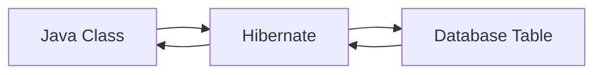
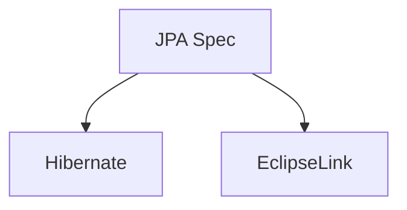
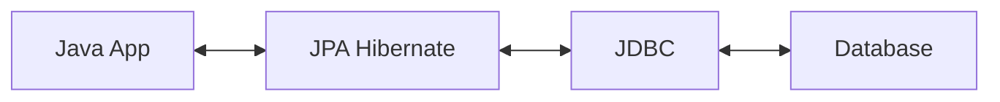

# [NEW] Spring Boot 3 Spring 6 and Hibernate for Beginners

## Section 3: NEW - Hibernate / JPA CRUD

### 62. Hibernate / JPA Overview

- What is Hibernate?
- Benefits of Hibernate
- What is JPA?
- Benefits of JPA

Hibernate is a framework for persisting / saving Java objects in a database.

Benefits of Hibernate:

- Handles all of the low-level SQL
- Minimizes the amount of JDBC code you have to develop
- Hibernate provides the Object-to-Relational Mapping (ORM)

Object-To-Relational Mapping (ORM)

- We define the mapping between Java class and database table.



What is JPA?

- Jakarta Persistence API (JPA) is a Java specification for accessing, persisting, and managing data between Java objects / classes and a relational database.
- Standard API for Object-to-Relational Mapping (ORM).
- Only a specification, not an implementation.
  - Defined a set of interfaces
  - Requires an implementation to be usable



What are the benefits of JPA?

- By having a standard API, we are not vendor locked in.
- Maintain portable, flexible code by using JPA interfaces.
- Can theoretically switch vendor implementations:
  - For example, if vendor A stops supporting their product we can switch to vendor B.

Code snippet:

```java
// create Java object
Student theStudent = new Student("Paul", "Wall", "paul@gmail.com");

// save the student
entityManager.persist(theStudent);
```

Old days of JDBC you would have to manually write the SQL code.

Retrieving data:

```java
int theId = 1;
Student theStudent = entityManager.find(Student.class, theId);
```

Querying for Java Objects:

```java
TypedQuery<Student> theQuery = entityManager.createQuery("from Student", Student.class);
List<Student> students = theQuery.getResultList();
```

We will cover CRUD:

- Create
- Read
- Update
- Delete

### 63. Hibernate, JPA and JDBC

Hibernate / JPA uses JDBC for all database interactions.


