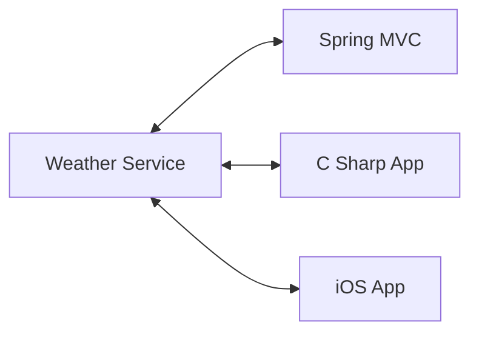

# [NEW] Spring Boot 3 Spring 6 and Hibernate for Beginners

## Section 4: NEW - REST CRUD APIs

### 90. What Are REST Services - Part 1

In this chapter we will:

- Create REST APIs / Web Services with Spring Boot
- Discuss REST concepts, JSON and HTTP messaging
- Install REST client tool: Postman
- Develop REST APIs / Web Services with @RestController
- Build a CRUD interface to the database with Spring REST

This tutorial is focused on practical results not the whole Spring Refece documentation.

When we create an app we can connect the app to backend service with REST APIs over HTTP.

REST: Representational State Transfer

Lightweight, maintainable, scalable and stateless.

REST is language and platform independent, client can use any programming language. Server can use any programming language.

REST applications can use any dta format commonly uses JSON or XML. JSON is the most popular.

JSON: JavaScript Object Notation

### 91. What Are REST Services - Part 2

This part is about several examples of REST services.

### 92. JSON Basics

