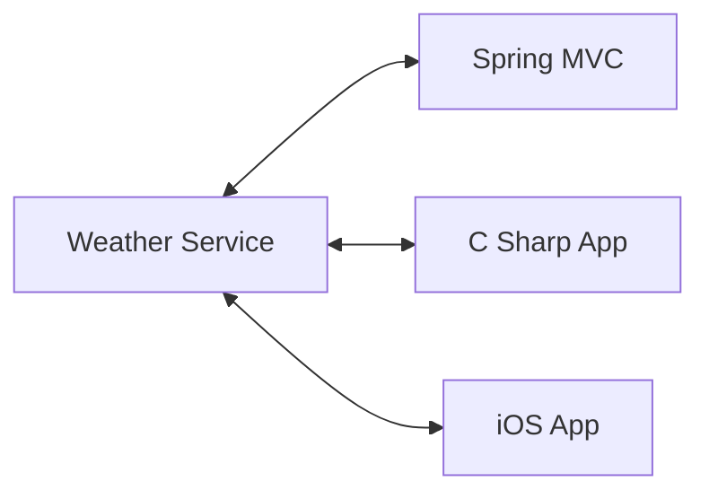
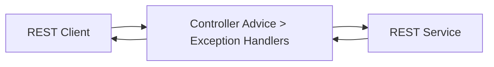
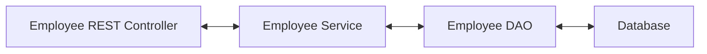
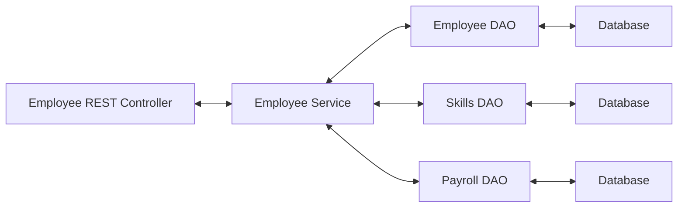

# [NEW] Spring Boot 3 Spring 6 and Hibernate for Beginners

## Section 4: NEW - REST CRUD APIs

### 90. What Are REST Services - Part 1

In this chapter we will:

- Create REST APIs / Web Services with Spring Boot
- Discuss REST concepts, JSON and HTTP messaging
- Install REST client tool: Postman
- Develop REST APIs / Web Services with @RestController
- Build a CRUD interface to the database with Spring REST

This tutorial is focused on practical results not the whole Spring Refece documentation.

When we create an app we can connect the app to backend service with REST APIs over HTTP.

REST: Representational State Transfer

Lightweight, maintainable, scalable and stateless.

REST is language and platform independent, client can use any programming language. Server can use any programming language.

REST applications can use any dta format commonly uses JSON or XML. JSON is the most popular.

JSON: JavaScript Object Notation



### 91. What Are REST Services - Part 2

This part is about several examples of REST services.

### 92. JSON Basics

What is JSON?

- JavaScript Object Notation
- Lightweight data format for storing and exchanging data
- Language independent, not just for JavaScript
- Can use with any programming language: Java, C#, Python, etc.

Simple JSON Example:

```json
{
  "name": "Ranga",
  "age": 35,
  "isProgrammer": true
}
```

Curly braces define objects in JSON. Object members are name / value pairs. Name is always double quoted, "name", "age", "isProgrammer".

JSON values:

- numbers. no quotes
- string: double quotes
- boolean: true or false
- nested JSON objects
- arrays
- null

Nested JSON Example:

```json
{
  "name": "Ranga",
  "age": 35,
  "isProgrammer": true,
  "address": {
    "city": "New York",
    "state": "NY"
  }
}
```

### 93. Spring Boot REST HTTP Basics

Most common use of REST is over HTTP.

We can leverage HTTP methods to create RESTful services.

- POST: Create a new entity
- GET: Read a list of entities or a single entity
- PUT: Update an existing entity
- DELETE: Delete an entity

HTTP Request Message

- Request Line: the HTTP command
- Header variables: request metadata
- Message body: contents of message

HTTP Response Message

- Response line: server protocol and status code
- Header variables: response metadata
- Message body: contents of message

HTTP Response Status Codes

- 100-199: Informational
- 200-299: Success
- 300-399: Redirection
- 400-499: Client Error
- 500-599: Server Error

MIME Content Types (Multipurpose Internet Mail Extensions)

- Basic syntax: type/subtype
- Examples:
  - text/html, text/plain, text/xml
  - application/json, application/xml

We can use curl or Postman to test REST services. We can install Postman to test REST services.

### 94. Postman Demo

We nca install the Postman app to test REST services.

### 95. Spring Boot REST Controller - Overview - Part 1

Basic structure of a REST Controller:

```java
@RestController
@RequestMapping("/test")
public class DemoRestController {
  @GetMapping("/hello")
  public String sayHello() {
    return "Hello World";
  }
}
```

- @RestController: Adds REST support.
- Access the REST endpoint at /test/hello.
- Return returns the content to client.

For simple testing we can use browser or Postman. For advanced cases Postman is better.

### 96. Spring Boot REST Controller - Overview - Part 2

For REST development we need to add spring-boot-starter-web dependency.

```xml
<dependency>
  <groupId>org.springframework.boot</groupId>
  <artifactId>spring-boot-starter-web</artifactId>
</dependency>
```

### 97. Spring Boot REST Controller - Coding

We can create the project from Initializr. We can add the spring-boot-starter-web dependency.

After we add the controller we can run the application and test the REST service with Postman.

```java
@RestController
@RequestMapping("/test")
public class DemoRestController {
  @GetMapping("/hello")
  public String sayHello() {
    return "Hello World";
  }
}
```

### 98. JSON Jackson Data Binding

Data binding is the process of converting JSON data to Java POJO. 

Data binding:


Also known as:

- Mapping
- Serialization / Deserialization
- Marshalling / Unmarshalling

JSON data binding with Jackson:

- Spring uses the Jackson Project behind the scenes
- Jackson handles data binding between JSON and Java POJO
- Jackson project URL: [link](https://github.com/FasterXML/jackson-databind)

JSON to Java POJO

JSON data:
  
  ```json
  {
    "id": 14,
    "firstName": "Mario",
    "lastName": "Rossi",
    "active": true
  }
  ```

Java POJO:

```java
public class Student {
  private int id;
  private String firstName;
  private String lastName;
  private boolean active;
  // Getters and setters
}
```

Java POJO to JSON

- We cam call getter methods on POJO to get JSON data.

Spring and Jackson Support

- When we building Spring REST applications
- Spring will automatically handle JSON Integration
- JSON data being passed to REST controller is automatically converted to Java POJO
- Java object being returned from REST controller is automatically converted to JSON

### 99. Spring Boot REST POJO - Overview

Create new service:

Return a list of students: GET /api/students Returns a list of students.

We need to convert Java POJO to JSON:

- Our REST Service will return List < Student >
- We need to convert List < Student > to JSON
- Jackson can help us out here

Spring Boot and Jackson Support

- Spring Boot will automatically handle Jackson integration
- JSON data being passed to REST controller is converted to Java POJO
- Java POJO being returned from REST controller is converted to JSON

Step 1: Create Java POJO class for Student

Student.java:

```java
public class Student {
  private String firstName;
  private String lastName;

  public Student() {
  }

  public Student(String firstName, String lastName) {
    this.firstName = firstName;
    this.lastName = lastName;
  }

  public String getFirstName() {
    return firstName;
  }

  public void setFirstName(String firstName) {
    this.firstName = firstName;
  }

  public String getLastName() {
    return lastName;
  }

  public void setLastName(String lastName) {
    this.lastName = lastName;
  }
}
```

Step 2: Create REST Controller to return List < Student >

```java
@RestController
@RequestMapping("/api")
public class StudentRestController {
  @GetMapping("/students")
  public List<Student> getStudents() {
    List<Student> students = new ArrayList<>();
    students.add(new Student("Mario", "Rossi"));
    students.add(new Student("Maria", "Rossi"));
    students.add(new Student("Antonio", "Rossi"));
    return students;
  }
}
```

### 100. Spring Boot REST POJO - Coding - Part 1

I will skip the coding part.

### 101. Spring Boot REST POJO - Coding - Part 2

I will skip the coding part.

### 102. Spring Boot REST Path Variables - Overview

We will create a GET /api/students/{studentId} to return a single student.

This variable is a path variable.

StudentRestController.java:

```java
@RestController
@RequestMapping("/api")
public class StudentRestController {
  
  // define endpoint for "/students/{studentId}" - return student at index

  @GetMapping("/students/{studentId}")
  public Student getStudent(@PathVariable int studentId) {
    List<Student> students = new ArrayList<>();
    
    students.add(new Student("Mario", "Rossi"));
    students.add(new Student("Maria", "Rossi"));
    students.add(new Student("Antonio", "Rossi"));

    return students.get(studentId);
  }
}
```

### 103. Spring Boot REST Path Variables - Coding - Part 1

We can provide some default Student list to StudentRestController.

```java
@RestMapping("/api")
public class StudentRestController {
  private List<Student> theStudents;

  @PostConstruct
  public void loadData() {
    theStudents = new ArrayList<>();
    theStudents.add(new Student("Mario", "Rossi"));
    theStudents.add(new Student("Maria", "Rossi"));
    theStudents.add(new Student("Antonio", "Rossi"));
  }

  @GetMapping("/students")
  public List<Student> getStudents() {
    return theStudents;
  }

  @GetMapping("/students/{studentId}")
  public Student getStudent(@PathVariable int studentId) {
    return theStudents.get(studentId);
  }
}
```

### 104. Spring Boot REST Path Variables - Coding - Part 2

In this part we have already seeing the results for singular and multiple students.

If we use a large value for studentId we will get an error, it will cause a out of bounds exception. We will look at exceptions in next chapter.

### 105. Spring Boot REST Exception Handling - Overview - Part 1

We want to see a proper exception response from the REST service, not a stack trace.

```json
{
  "status": 404,
  "message": "Student id not found - 9999",
  "timeStamp": "2022-01-01T10:00:00"
}
```

Development Process:

1. Create a custom error response class
2. Create a custom exception class
3. Update REST service to throw exception if student not found
4. Add an exception handler method using @ExceptionHandler

Step 1: Create a custom error response class

- Custom error response class will be sent back to client
- We will define a Java class (POJO)
- Jackson will handle converting it to JSON

StudentErrorResponse.java:

```java
public class StudentErrorResponse {
  private int status;
  private String message;
  private long timeStamp;

  // Getters and setters

  //constructors
}
```

Step 2: Create a custom exception class

- The custom student exception will used by our REST service
- In our code, if we can't find student, then we will throw an exception
- We need to define a custom student exception class, StudentNotFoundException

```java
public class StudentNotFoundException extends RuntimeException {
  public StudentNotFoundException(String message) {
    super(message);
  }
}
```

### 106. Spring Boot REST Exception Handling - Overview - Part 2

Step 3: Update REST service to throw exception

StudentRestController.java:

```java
@RestController
@RequestMapping("/api")
public class StudentRestController {

  @GetMapping("/students/{studentId}")
  public Student getSudent(@PathVariable int studentId) {
    if (studentId >= theStudents.size() || studentId < 0) {
      throw new StudentNotFoundException("Student id not found - " + studentId);
    }
    return theStudents.get(studentId);
  }
}
```

Step 4: Add exception handler method

- Define exception handler methods(s) with @ExceptionHandler annotation
- Exception handler will return a ResponseEntity
- ResponseEntity is a wrapper for the HTTP response object
- ResponseEntity provides fine-grained control to specify: HTTP status code, HTTP headers, response body

```java 
@RestController
@RequestMapping("/api")
public class StudentRestController {

  @ExceptionHandler
  public ResponseEntity<StudentErrorResponse> handleException(StudentNotFoundException exc) {
    StudentErrorResponse error = new StudentErrorResponse();
    error.setStatus(HttpStatus.NOT_FOUND.value());
    error.setMessage(exc.getMessage());
    error.setTimeStamp(System.currentTimeMillis());
    return new ResponseEntity<>(error, HttpStatus.NOT_FOUND);
  }
}
```

### 107. Spring Boot REST Exception Handling - Coding - Part 1

I will skip the coding part.

### 108. Spring Boot REST Exception Handling - Coding - Part 2

I will skip the coding part.

### 109. Spring Boot REST Exception Handling - Coding - Part 3

I will skip the coding part.

### 110. Spring Boot REST Exception Handling - Coding - Part 4

We can create a exception handler for generic exceptions.

```java
@RestController
@RequestMapping("/api")
public class StudentRestController {

  @ExceptionHandler
  public ResponseEntity<StudentErrorResponse> handleException(Exception exc) {
    StudentErrorResponse error = new StudentErrorResponse();
    error.setStatus(HttpStatus.BAD_REQUEST.value());
    error.setMessage(exc.getMessage());
    error.setTimeStamp(System.currentTimeMillis());
    return new ResponseEntity<>(error, HttpStatus.BAD_REQUEST);
  }
}
```

### 111. Spring Boot REST Exception Handling Overview

Creating a exception handler for a specific controller works but large projects will have many controllers.

They can't be reused by other controllers.

We need global exception handlers

- Promotes reuse
- Centralizes exception handling

Spring @ControllerAdvice

- @ControllerAdvice is similar to an interceptor / filter
- Pre-process requests to controllers
- Post-process responses to handle exceptions
- Perfect for global exception handling

This is a real-time use of AOP (Aspect Oriented Programming). AOP is a programming paradigm that aims to increase modularity by allowing the separation of cross-cutting concerns.



Development Process:

1. Create new @ControllerAdvice
2. Refactor REST service, remove exception handling code
3. Add exception handling code to @ControllerAdvice

Step 1: Create new @ControllerAdvice

StudentRestExceptionHandler.java:

```java
@ControllerAdvice
public class StudentRestExceptionHandler {
  // Add exception handling code here
}
```

Step 2: Refactor REST service, remove exception handling code

We need to remove the @ExceptionHandler from the REST service.

Step 3: Add exception handling code to @ControllerAdvice

StudentRestExceptionHandler.java:

```java
@ControllerAdvice
public class StudentRestExceptionHandler {
  @ExceptionHandler
  public ResponseEntity<StudentErrorResponse> handleException(StudentNotFoundException exc) {
    StudentErrorResponse error = new StudentErrorResponse();
    error.setStatus(HttpStatus.NOT_FOUND.value());
    error.setMessage(exc.getMessage());
    error.setTimeStamp(System.currentTimeMillis());
    return new ResponseEntity<>(error, HttpStatus.NOT_FOUND);
  }
  @ExceptionHandler
  public ResponseEntity<StudentErrorResponse> handleException(Exception exc) {
    StudentErrorResponse error = new StudentErrorResponse();
    error.setStatus(HttpStatus.BAD_REQUEST.value());
    error.setMessage(exc.getMessage());
    error.setTimeStamp(System.currentTimeMillis());
    return new ResponseEntity<>(error, HttpStatus.BAD_REQUEST);
  }
}
```

### 112. Spring Boot REST Exception Handling - Coding

I will skip the coding part.

### 113. Spring Boot REST API Design - Best Practices

REST API Design

- For real-time projects, who will use your API
- How they will use your API
- We need to design API based on requirements

API design process

1. Review API requirements
2. Identify main resource / entity
3. Use HTTP methods to assign action on resource

Step 1: Review API requirements

An example requirement:

- Create a REST API for employee management
- REST client should be able to
  - Get a list of employees
  - Get a single employee by id
  - Add a new employee
  - Update an employee
  - Delete an employee

Step 2: Identify main resource / entity

From the requirements we can identify the main resource / entity: Employee

Convention is to use plural form of resource / entity: employees

- /api/employees

Step 3: Use HTTP methods to assign action on resource

- POST: Create a new entity
- GET: Read a list of entities or a single entity
- PUT: Update an existing entity
- DELETE: Delete an existing entity

FULL CRUD.

We can create an URL table:

| HTTP Method | URL | CRUD Action |
| --- | --- | --- |
| GET | /api/employees | Read a list of employees |
| GET | /api/employees/{employeeId} | Read a single employee |
| POST | /api/employees | Create a new employee |
| PUT | /api/employees | Update an existing employee |
| DELETE | /api/employees/{employeeId} | Delete an existing employee |

ANTI-PATTERNS

- DO NOT DO THIS: These are REST anti-patterns, bad practice
  - /api/employeesList
  - /api/deleteEmployee
  - /api/addEmployee
  - /api/updateEmployee

Don't include actions in the endpoint URL. Instead use HTTP methods.

### 114. Spring Boot REST API Design - API Design of Real-Time Projects

Several real world examples:

PayPal:

- Invoicing API
- POST /v1/invoicing/invoices: Create draft invoice
- GET /v1/invoicing/invoices: List invoices
- GET /v1/invoicing/invoices/{invoiceId}: Show invoice details
- PUT /v1/invoicing/invoices/{invoiceId}: Update invoice
- DELETE /v1/invoicing/invoices/{invoiceId}: Delete invoice

GitHub:

- Repositories API
- POST /user/repos: Create a new repository
- GET /user/repos: List your repositories
- DELETE /repos/{owner}/{repo}: Delete a repository
- GET /repos/{owner}/{repo}: Get a repository

### 115. Spring Boot REST Project Overview

| HTTP Method | URL | CRUD Action |
| --- | --- | --- |
| GET | /api/employees | Read a list of employees |
| GET | /api/employees/{employeeId} | Read a single employee |
| POST | /api/employees | Create a new employee |
| PUT | /api/employees | Update an existing employee |
| DELETE | /api/employees/{employeeId} | Delete an existing employee |

Development Process

1. Set up Database Dev Environment
2. Create Spring Boot project using Spring Initializr
3. Get list of employees
4. Get single employee by ID
5. Add a new employee
6. Update an existing employee
7. Delete an existing employee



For initial DB creation we will use a SQL script:

```sql
CREATE DATABASE IF NOT EXISTS 'employee_directory';
USE 'employee_directory';

DROP TABLE IF EXISTS 'employee';

CREATE TABLE 'employee' (
  'id' int(11) NOT NULL AUTO_INCREMENT,
  'first_name' varchar(45) DEFAULT NULL,
  'last_name' varchar(45) DEFAULT NULL,
  'email' varchar(45) DEFAULT NULL,
  PRIMARY KEY ('id')
);

INSERT INTO 'employee' VALUES 
  (1, 'Mario', 'Rossi', 'test@gmail.com'),
  (2, 'Juan', 'Perez', 'test2@gmail.com");
```

### 116. Spring Boot REST Create Project

For a starter project we can use Spring Initializr.

- Spring Web
- Spring Data JPA
- SpringBoot DevTools
- MySQL Driver

### 117. Spring Boot REST DAO

We will create a JPA (Java Persistence API) DAO (Data Access Object) to interact with the database.

DAO Implementation:

```java
@Repository
public class EmployeeDAOJpaImpl imlements EmployeeDAO {
  private EntityManager entityManager;

  @Autowired
  public EmployeeDAOJpaImpl(EntityManager theEntityManager) {
    entityManager = theEntityManager;
  }
}
```

Get a list of employees:
  
```java
@Override
public List<Employee> findAll() {
  TypedQuery<Employee> theQuery = entityManager.createQuery("from Employee", Employee.class);
  List<Employee> employees = theQuery.getResultList();
  return employees;
}
```

Development Process:

1. Update db configs in application.properties
2. Create employee entity
3. Create DAO interface
4. Create DAO implementation
5. Create REST controller to use DAO

### 118. Spring Boot REST DAO - Coding - Part 1

Let's create the Employee entity:

```java
@Entity
@Table(name="employee")
public class Employee {
  @Id
  @GeneratedValue(strategy=GenerationType.IDENTITY)
  @Column(name="id")
  private int id;

  @Column(name="first_name")
  private String firstName;

  @Column(name="last_name")
  private String lastName;

  @Column(name="email")
  private String email;

  //No-args constructor required by JPA
  public Employee() {
  }

  public Employee(String firstName, String lastName, String email) {
    this.firstName = firstName;
    this.lastName = lastName;
    this.email = email;
  }

  @Override
  public String toString() {
    return "Employee{" +
      "id=" + id +
      ", firstName='" + firstName + '\'' +
      ", lastName='" + lastName + '\'' +
      ", email='" + email + '\'' +
      '}';

  // Getters and setters
}
```

### 119. Spring Boot REST DAO - Coding - Part 2

Let's create the EmployeeDAO interface:

```java
public interface EmployeeDAO {
  public List<Employee> findAll();
  public Employee findById(int theId);
  public void save(Employee theEmployee);
  public void deleteById(int theId);
}
```

We will create the EmployeeDAOJpaImpl class:

```java
@Repository
public class EmployeeDAOJpaImpl implements EmployeeDAO {
  private EntityManager entityManager;

  @Autowired
  public EmployeeDAOJpaImpl(EntityManager theEntityManager) {
    entityManager = theEntityManager;
  }

  @Override
  public List<Employee> findAll() {
    TypedQuery<Employee> theQuery = entityManager.createQuery("from Employee", Employee.class);
    List<Employee> employees = theQuery.getResultList();
    return employees;
  }

  @Override
  public Employee findById(int theId) {
    Employee theEmployee = entityManager.find(Employee.class, theId);
    return theEmployee;
  }

  @Override
  public void save(Employee theEmployee) {
    Employee dbEmployee = entityManager.merge(theEmployee);
    theEmployee.setId(dbEmployee.getId());
  }

  @Override
  public void deleteById(int theId) {
    Query theQuery = entityManager.createQuery("delete from Employee where id=:employeeId");
    theQuery.setParameter("employeeId", theId);
    theQuery.executeUpdate();
  }
}
```

### 120. Spring Boot REST DAO - Coding - Part 3

Create the EmployeeRestController:

```java
@RestController
@RequestMapping("/api")
public class EmployeeRestController {
  private EmployeeDAO employeeDAO;

  @Autowired
  public EmployeeRestController(EmployeeDAO theEmployeeDAO) {
    employeeDAO = theEmployeeDAO;
  }

  @GetMapping("/employees")
  public List<Employee> findAll() {
    return employeeDAO.findAll();
  }

  @GetMapping("/employees/{employeeId}")
  public Employee getEmployee(@PathVariable int employeeId) {
    Employee theEmployee = employeeDAO.findById(employeeId);
    if (theEmployee == null) {
      throw new RuntimeException("Employee id not found - " + employeeId);
    }
    return theEmployee;
  }

  @PostMapping("/employees")
  public Employee addEmployee(@RequestBody Employee theEmployee) {
    theEmployee.setId(0);
    employeeDAO.save(theEmployee);
    return theEmployee;
  }

  @PutMapping("/employees")
  public Employee updateEmployee(@RequestBody Employee theEmployee) {
    employeeDAO.save(theEmployee);
    return theEmployee;
  }

  @DeleteMapping("/employees/{employeeId}")
  public String deleteEmployee(@PathVariable int employeeId) {
    Employee tempEmployee = employeeDAO.findById(employeeId);
    if (tempEmployee == null) {
      throw new RuntimeException("Employee id not found - " + employeeId);
    }
    employeeDAO.deleteById(employeeId);
    return "Deleted employee id - " + employeeId;
  }
}
```

### 121. Spring Boot Define Service Layer - Overview


In this part we will explore the service layer.

A service layer is a design pattern that acts as an interface between a controller and a DAO.

Purpose of Service Layer

- Service Facade design pattern
- Intermediate layer for custom business logic
- Integrate data from multiple sources (DAOs)



Employee service will provide controller with a single view of the data that we integrated from multiple backend sources.

Specialized Annotation for Services

- @Service applied to Service implementations
- Spring will automatically register the Service implementation thanks to component scanning

Design Steps

1. Define Service interface
2. Define Service implementation
   - Inject DAOs into Service

Step 1: Define Service interface

EmployeeService.java:

```java
public interface EmployeeService {
  public List<Employee> findAll();
  public Employee findById(int theId);
  public void save(Employee theEmployee);
  public void deleteById(int theId);
}
```

Step 2: Define Service implementation

EmployeeServiceImpl.java:

```java
@Service
public class EmployeeServiceImpl implements EmployeeService {
  private EmployeeDAO employeeDAO;

  @Autowired
  public EmployeeServiceImpl(EmployeeDAO theEmployeeDAO) {
    employeeDAO = theEmployeeDAO;
  }

  @Override
  public List<Employee> findAll() {
    return employeeDAO.findAll();
  }

  @Override
  public Employee findById(int theId) {
    return employeeDAO.findById(theId);
  }

  @Override
  public void save(Employee theEmployee) {
    employeeDAO.save(theEmployee);
  }

  @Override
  public void deleteById(int theId) {
    employeeDAO.deleteById(theId);
  }
}
```

### 122. Spring Boot Define Service Layer - Coding

I will skip the coding part.

### 123. Spring Boot DAO: Add, Update, Delete - Overview

Service Layer - Best Practices

- Best practice is to apply transactional boundaries to service layer
- Is is the service layer's responsibility to manage transaction boundaries
- For the implementation
  - Apply @Transactional annotation to service methods
  Remove @Transactional from DAO methods if they already exist

DAO methods:

- Get single employee by ID
- Add a new employee
- Update an existing employee
- Delete an existing employee

DAO (Data Access Object): Get a single employee

```java
@Override
public Employee findById(int theId) {
  return entityManager.find(Employee.class, theId);
}
```

DAO: Add or Update an employee

```java
@Override
public void save(Employee theEmployee) {
  Employee dbEmployee = entityManager.merge(theEmployee);
  theEmployee.setId(dbEmployee.getId());
}
```

If id is 0 then it is a new employee, if id is not 0 then it is an existing employee.

DAO: Delete an employee

```java
@Override
public void deleteById(int theId) {
  Employee theEmployee = entityManager.find(Employee.class, theId);
  entityManager.remove(theEmployee);
}
```

### 124. Spring Boot DAO: Add, Update, Delete - Coding

EmployeeDAO.java:

```java
public interface EmployeeDAO {
  public List<Employee> findAll();
  public Employee findById(int theId);
  public Employee save(Employee theEmployee);
  public void deleteById(int theId);
}
```

EmployeeDAOJpaImpl.java:

```java
@Repository
public class EmployeeDAOJpaImpl implements EmployeeDAO {
  private EntityManager entityManager;

  @Autowired
  public EmployeeDAOJpaImpl(EntityManager theEntityManager) {
    entityManager = theEntityManager;
  }

  @Override
  public List<Employee> findAll() {
    TypedQuery<Employee> theQuery = entityManager.createQuery("from Employee", Employee.class);
    List<Employee> employees = theQuery.getResultList();
    return employees;
  }

  @Override
  public Employee findById(int theId) {
    return entityManager.find(Employee.class, theId);
  }

  @Override
  public Employee save(Employee theEmployee) {
    Employee dbEmployee = entityManager.merge(theEmployee);
    theEmployee.setId(dbEmployee.getId());
    return theEmployee;
  }

  @Override
  public void deleteById(int theId) {
    Query theQuery = entityManager.createQuery("delete from Employee where id=:employeeId");
    theQuery.setParameter("employeeId", theId);
    theQuery.executeUpdate();
  }
}
```

IMPORTANT: If we are using Service layer we need to remove the @Transactional from the DAO layer. Service layer will handle the transactional boundaries.

### 125. Spring Boot Service: Add, Update, Delete - Coding

We will add the method to service interface:

EmployeeService.java:

```java
public interface EmployeeService {
  public List<Employee> findAll();
  public Employee findById(int theId);
  public Employee save(Employee theEmployee);
  public void deleteById(int theId);
}
```

EmployeeServiceImpl.java:

```java
@Service
public class EmployeeServiceImpl implements EmployeeService {
  private EmployeeDAO employeeDAO;

  @Autowired
  public EmployeeServiceImpl(EmployeeDAO theEmployeeDAO) {
    employeeDAO = theEmployeeDAO;
  }

  @Override
  public List<Employee> findAll() {
    return employeeDAO.findAll();
  }

  @Override
  public Employee findById(int theId) {
    return employeeDAO.findById(theId);
  }

  @Override
  public Employee save(Employee theEmployee) {
    return employeeDAO.save(theEmployee);
  }

  @Override
  public void deleteById(int theId) {
    employeeDAO.deleteById(theId);
  }
}
```

### 126. Spring Boot: Get Single Employee - Coding

When we create a new entity we use POST method, we need to configure correctly the REST client. If we are using POSTMAN we should configure the body and the headers.

We can create the API endpoint:

```java
@GetMapping("/employees/{employeeId}")
public Employee getEmployee(@PathVariable int employeeId) {
  Employee theEmployee = employeeService.findById(employeeId);
  if (theEmployee == null) {
    throw new RuntimeException("Employee id not found - " + employeeId);
  }
  return theEmployee;
}
```

### 127. Spring Boot: Add New Employee - Coding

We can create the API endpoint:

```java
@PostMapping("/employees")
public Employee addEmployee(@RequestBody Employee theEmployee) {
  theEmployee.setId(0);
  employeeService.save(theEmployee);
  return theEmployee;
}
```

### 128. Spring Boot: Update Employee - Coding

We can create the API endpoint:

```java
@PutMapping("/employees")
public Employee updateEmployee(@RequestBody Employee theEmployee) {
  Employee employee = employeeService.save(theEmployee);
  return employee;
}
```

### 129. Spring Boot: Delete Employee - Coding

We can create the API endpoint:

```java
@DeleteMapping("/employees/{employeeId}")
public String deleteEmployee(@PathVariable int employeeId) {
  Employee theEmployee = employeeService.findById(employeeId);
  if (theEmployee == null) {
    throw new RuntimeException("Employee id not found - " + employeeId);
  }
  employeeService.deleteById(employeeId);
  return "Deleted employee id - " + employeeId;
}
```

### 130. Spring Boot REST: Spring Data JPA - Overview

Previously we used JPA to create the DAO layer.

Now we will focus on Spring Data JPA.

Issue

- We created the DAO by creating EmployeeDAO and EmployeeDAOJpaImpl. We implemented the methods to interact with the database.
- What will happen if we need to create a DAO for other entities?
- Do we need to repeat the same process for each entity?

In a perfect scenario I should be able to tell Spring:

- Create a DAO for me
- Plug in my entity type and primary key
- Give me all of the basic CRUD features for free

Spring Data JPA (Java Persistence API) - SOLUTION

- We can create a DAO and just plug in our entity type and primary key
- Spring will give us the CRUD implementation for free, it can help us to minimize the boilerplate code

Development Process

1. Extend JpaRepository interface
2. Use your Repository in your application

Step 1: Extend JpaRepository interface

```java
public interface EmployeeRepository extends JpaRepository<Employee, Integer> {
}
```

No need for the implementation class. We will get these methods for free:

- findAll()
- findById()
- save()
- deleteById()

Step 2: Use your Repository in your application

```java
@Service
public class EmployeeServiceImpl implements EmployeeService {
  private EmployeeRepository employeeRepository;

  @Autowired
  public EmployeeServiceImpl(EmployeeRepository theEmployeeRepository) {
    employeeRepository = theEmployeeRepository;
  }
}
```

Spring JPA Advanced Features

- Extending and adding custom queries with JPQL
- Query Domain Specific Language (Query DSL)
- Define custom methods, low-level-code

### 131. Spring Boot REST: Spring Data JPA - Coding - Part 1

We can delete the @Transactional from the service layer.

EmployeeServiceImp.java:

```java
@Service
public class EmployeeServiceImpl implements EmployeeService {
  private EmployeeRepository employeeRepository;

  @Autowired
  public EmployeeServiceImpl(EmployeeRepository theEmployeeRepository) {
    employeeRepository = theEmployeeRepository;
  }

  @Override
  public List<Employee> findAll() {
    return employeeRepository.findAll();
  }

  @Override
  public Employee findById(int theId) {
    Optional<Employee> result = employeeRepository.findById(theId);
    Employee theEmployee = null;
    if (result.isPresent()) {
      theEmployee = result.get();
    } else {
      throw new RuntimeException("Did not find employee id - " + theId);
    }
    return theEmployee;
  }

  @Override
  public Employee save(Employee theEmployee) {
    return employeeRepository.save(theEmployee);
  }

  @Override
  public void deleteById(int theId) {
    employeeRepository.deleteById(theId);
  }
}
```

Spring JPA repository leverages optionals.

### 132. Spring Boot REST: Spring Data JPA - Coding - Part 2

This part mostly contains testing the API endpoints and checking the results on the database.

