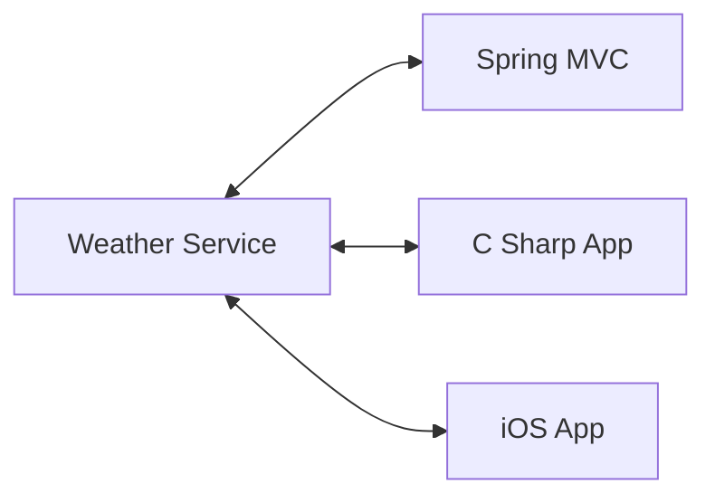

# [NEW] Spring Boot 3 Spring 6 and Hibernate for Beginners

## Section 4: NEW - REST CRUD APIs

### 90. What Are REST Services - Part 1

In this chapter we will:

- Create REST APIs / Web Services with Spring Boot
- Discuss REST concepts, JSON and HTTP messaging
- Install REST client tool: Postman
- Develop REST APIs / Web Services with @RestController
- Build a CRUD interface to the database with Spring REST

This tutorial is focused on practical results not the whole Spring Refece documentation.

When we create an app we can connect the app to backend service with REST APIs over HTTP.

REST: Representational State Transfer

Lightweight, maintainable, scalable and stateless.

REST is language and platform independent, client can use any programming language. Server can use any programming language.

REST applications can use any dta format commonly uses JSON or XML. JSON is the most popular.

JSON: JavaScript Object Notation



### 91. What Are REST Services - Part 2

This part is about several examples of REST services.

### 92. JSON Basics

What is JSON?

- JavaScript Object Notation
- Lightweight data format for storing and exchanging data
- Language independent, not just for JavaScript
- Can use with any programming language: Java, C#, Python, etc.

Simple JSON Example:

```json
{
  "name": "Ranga",
  "age": 35,
  "isProgrammer": true
}
```

Curly braces define objects in JSON. Object members are name / value pairs. Name is always double quoted, "name", "age", "isProgrammer".

JSON values:

- numbers. no quotes
- string: double quotes
- boolean: true or false
- nested JSON objects
- arrays
- null

Nested JSON Example:

```json
{
  "name": "Ranga",
  "age": 35,
  "isProgrammer": true,
  "address": {
    "city": "New York",
    "state": "NY"
  }
}
```

### 93. Spring Boot REST HTTP Basics

Most common use of REST is over HTTP.

We can leverage HTTP methods to create RESTful services.

- POST: Create a new entity
- GET: Read a list of entities or a single entity
- PUT: Update an existing entity
- DELETE: Delete an entity

HTTP Request Message

- Request Line: the HTTP command
- Header variables: request metadata
- Message body: contents of message

HTTP Response Message

- Response line: server protocol and status code
- Header variables: response metadata
- Message body: contents of message

HTTP Response Status Codes

- 100-199: Informational
- 200-299: Success
- 300-399: Redirection
- 400-499: Client Error
- 500-599: Server Error

MIME Content Types (Multipurpose Internet Mail Extensions)

- Basic syntax: type/subtype
- Examples:
  - text/html, text/plain, text/xml
  - application/json, application/xml

We can use curl or Postman to test REST services. We can install Postman to test REST services.

### 94. Postman Demo

We nca install the Postman app to test REST services.

### 95. Spring Boot REST Controller - Overview - Part 1

Basic structure of a REST Controller:

```java
@RestController
@RequestMapping("/test")
public class DemoRestController {
  @GetMapping("/hello")
  public String sayHello() {
    return "Hello World";
  }
}
```

- @RestController: Adds REST support.
- Access the REST endpoint at /test/hello.
- Return returns the content to client.

For simple testing we can use browser or Postman. For advanced cases Postman is better.

### 96. Spring Boot REST Controller - Overview - Part 2

For REST development we need to add spring-boot-starter-web dependency.

```xml
<dependency>
  <groupId>org.springframework.boot</groupId>
  <artifactId>spring-boot-starter-web</artifactId>
</dependency>
```

### 97. Spring Boot REST Controller - Coding

We can create the project from Initializr. We can add the spring-boot-starter-web dependency.

After we add the controller we can run the application and test the REST service with Postman.

```java
@RestController
@RequestMapping("/test")
public class DemoRestController {
  @GetMapping("/hello")
  public String sayHello() {
    return "Hello World";
  }
}
```

